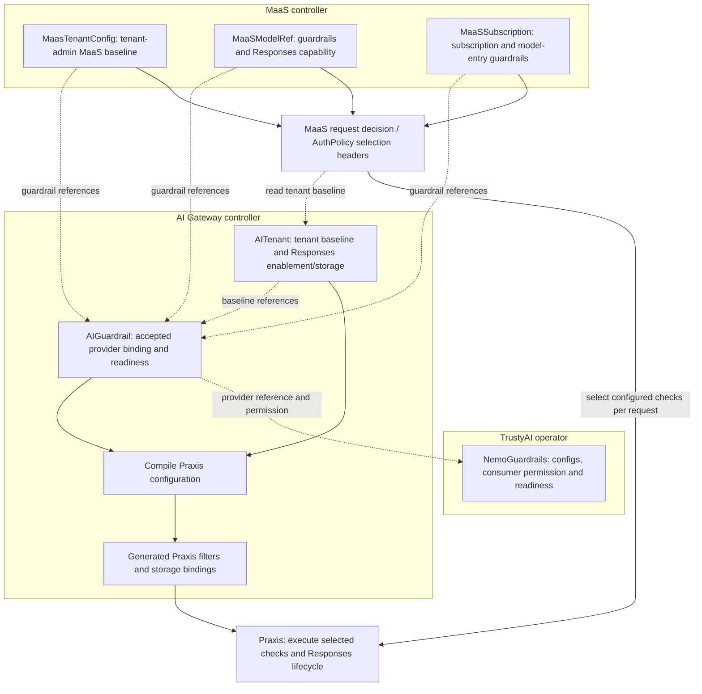

``# Responses and guardrails: high-level design

|         |                                                       |
|---------|-------------------------------------------------------|
| Status  | Proposed                                              |
| Authors | Pierangelo Di Pilato, Christina Xu, Marius Ion Danciu |

This document presents the decisions, resource examples and ownership boundaries. Start here before reviewing the
detailed contracts.

In this document:

- [What](#what)
- [Why](#why)
- [Goals](#goals)
- [Non-Goals](#non-goals)
- [How](#how)
- [Security and Privacy Considerations](#security-and-privacy-considerations)
- [Open Questions](#open-questions)
- [Alternatives](#alternatives)
- [Risks](#risks)
- [Stakeholder Impacts](#stakeholder-impacts)
- [Reviews](#reviews)

## What

Enable the Responses API at the AI tenant level, with tenant-owned orchestration and persistent storage. Extend Tenant,
Subscription and Model configuration with NeMo-backed content checks whose selections accumulate deterministically
across scopes. A scope cannot remove checks attached by another scope.

The decision is to separate infrastructure enablement from request policy and use additive guardrail attachments. MaaS
resolves policy for the authenticated tenant, selected subscription and resolved model; Praxis executes the resulting
plan and owns the public Responses lifecycle. NeMo evaluates content through its checks API rather than becoming the
inference proxy.

## Why

Responses introduces state and outbound work beyond a single model invocation:
continuation IDs, stored inputs and outputs, conversations, and potentially tool loops. Enabling a route alone cannot
provide storage isolation, correct authorization for bodyless operations, or coherent state across replicas. These
responsibilities need a lifecycle owner with permission to deploy infrastructure and bind a database.

Guardrails introduce a different ownership problem. A platform administrator may require baseline safety, a model
publisher may require domain-specific checks, and a subscription administrator may need application-specific behavior.
Model and Subscription are related through a request, not through Kubernetes ownership. A single last-writer-wins
hierarchy cannot preserve all three administrative authorities. The initial API therefore combines their selections;
optional defaults and overrides remain a [future expansion](04-guardrails-future-expansion.md).

The supplied examples demonstrate useful building blocks, but not the complete contract. In particular, the Responses
example requires an outer authorization boundary; the NeMo adapter lacks config selection; Chat-only extraction does not
protect Responses; SSE bypasses output evaluation; and tenant-scoped storage does not establish principal ownership.
This ADR distinguishes those observed capabilities from the proposed additions and their release criteria.

## Goals

- Give tenant administrators and platform operators an explicit lifecycle for Responses infrastructure, external
  database binding and retained content.
- Preserve existing MaaS authentication, model access and selected-subscription semantics for each inference and
  stateful operation.
- Let Tenant, Subscription and Model define guardrails, with named check selection, additive composition and explicit
  failure semantics.
- Target the supplied NeMo v1 checks contract with approved, reusable policies.
- Prevent an unsupported protocol, modality, streaming mode or tool path from silently bypassing an effective check.
- Make policy provenance, runtime readiness and propagation observable without disclosing private governance or prompt
  content.
- Stage implementation so every advertised capability has integration coverage.

## Non-Goals

- Implement the CRDs, controllers or runtime in this documentation change.
- Reproduce all upstream Responses features in the first release, including background execution, WebSocket, arbitrary
  tools and all multimodal inputs.
- Make MaaS a NeMo configuration authoring system or install arbitrary detector models, Colang programs and action
  servers from inference requests.
- Claim production database HA, backups or restore through a development database deployment.
- Add cross-tenant model sharing, cross-user conversation sharing, mandatory-policy waivers, audit-only checks or
  redaction in the initial API.
- Define governance for AI Gateway requests that do not use MaaS subscriptions. Tenant infrastructure is reusable by
  such integrations, but their principal and policy-selection contract requires a separate design.

## How

This is an end-to-end design, to be delivered through independently reviewed increments. The narrative below describes
the decisions and flows; the companion documents define their detailed contracts. Existing Praxis filters are the
implementation baseline. Proposed MaaS/TrustyAI fields and integration requirements are not claims of current product
support.

### Key decisions

| Area                 | Decision                                                                                                                             | Detailed contract                                                                                                       |
|----------------------|--------------------------------------------------------------------------------------------------------------------------------------|-------------------------------------------------------------------------------------------------------------------------|
| Responses enablement | AITenant enables Responses and Conversations together                                                                                | [Enablement](02-responses-low-level-details.md#responses-enablement-and-lifecycle)                                      |
| Model capability     | `capabilities.responses.mode` defaults to `ChatCompletions`; explicit `Native` or `Unsupported`                                      | [API placement](#ownership-and-api-placement)                                                                           |
| Storage              | Shared platform Responses binding, separate from API-key storage; Praxis owns schema lifecycle                                       | [Database architecture](02-responses-low-level-details.md#responses-database-architecture-and-enterprise-isolation)     |
| Guardrails           | Reusable AIGuardrail policies attach at tenant, model, subscription and subscription model-entry scopes                              | [Resources](02-guardrails-low-level-details.md#reusable-guardrail-resources-and-attachments)                            |
| Composition          | Selected checks accumulate; empty or omitted check selectors select all checks                                                       | [Selection rules](02-guardrails-low-level-details.md#attachment-selection-and-composition)                              |
| References           | Tenant/subscription references use the enforced tenant namespace; model refs have two permitted targets; NeMo owners permit consumers through Same, Selector or All | [Reference authorization](02-guardrails-low-level-details.md#reference-authorization-discovery-and-model-applicability) |
| Execution            | Compile to existing Praxis filters using conditions or selected pipelines; initially ExtProc, later standalone                       | [Praxis mapping](02-guardrails-low-level-details.md#materializing-maas-configuration-in-praxis)                         |

### Ownership and API placement

“Tenant” is a logical scope, not a recommendation to extend the legacy `Tenant`
resource. The current code separates `AITenant` (Gateway, OIDC, payload-processing selection) from `MaasTenantConfig`
(MaaS-specific settings). Follow that separation:

| Resource                                       | Proposed responsibility                                         | Editor                          |
|------------------------------------------------|-----------------------------------------------------------------|---------------------------------|
| `AITenant.spec.responses`                      | Enable Responses and provision its runtime/storage dependencies | Platform administrator          |
| `AITenant.spec.guardrails`                     | Platform-admin baseline for the tenant                          | Platform administrator          |
| `MaasTenantConfig.spec.guardrails`             | Tenant-admin baseline across MaaS subscriptions and models      | Tenant administrator            |
| `AIGuardrail.spec`                             | Reusable ordered checks and a typed NeMo server reference       | Authorized policy administrator |
| `MaaSSubscription.spec.modelRefs[].guardrails` | Per-model refinement within a subscription                      | Tenant administrator            |
| `MaaSSubscription.spec.guardrails`             | Check selections for the selected subscription                  | Tenant administrator            |
| `MaaSModelRef.spec.guardrails`                 | Model owner's check selections                                  | Model publisher                 |
| `MaaSModelRef.spec.capabilities.responses`     | Declare supported backend protocol and adapter mode             | Model publisher                 |

The target architecture moves `AITenant` reconciliation and status ownership to AI Gateway controller alongside
`AIGuardrail`. This is a planned ownership transfer, not a claim about the current MaaS implementation. AI Gateway owns
tenant namespace/Gateway identity resolution, accepted tenant configuration, tenant-level guardrail reference
validation, Responses infrastructure/storage binding and capability readiness. MaaS consumes that published tenant
identity and baseline, validates its own MaasTenantConfig/model/subscription attachments, and applies the canonical MaaS
composition rules. MaaS must not patch AITenant status or independently reconcile its infrastructure. Moving controller
ownership does not by itself require changing AITenant's API group; that API migration is a separate compatibility
decision.

The two tenant scopes serve different editing personas. Platform administrators create AITenant in the configured
registry namespace (default `ai-tenants`). Today its reconciler creates or adopts `MaasTenantConfig/default-tenant`
in the resolved tenant namespace. Existing generated RBAC lets tenant administrators update/patch that singleton but
only read their AITenant. `MaasTenantConfig.spec.guardrails` therefore lets tenant administrators add a MaaS-wide
baseline without permission to edit platform infrastructure or remove the AITenant baseline. Its `guardrails` field is
proposed; the resource and this RBAC separation already exist.

In the target ownership split, MaaS owns MaasTenantConfig reconciliation and attachment status. MaaS discovers the
accepted tenant identity and ensures its singleton; moving AITenant to AI Gateway must not require AI Gateway to create,
watch or await MaasTenantConfig. MaaS combines the platform and tenant-admin baselines at request selection.

Responses infrastructure and the platform's tenant baseline belong to `AITenant`. Policy authors can manage
`AIGuardrail` independently through Kubernetes RBAC without write access to the whole `AITenant`, `MaaSSubscription`
or `MaaSModelRef`. The existing legacy `Tenant` remains outside the new API contract.

Use the resolved tenant identity and existing model/Gateway validation. A model belongs to one tenant in the initial
design, as in tenancy ADR MS-0003. Both local
`LLMInferenceService` and `ExternalModel` backends receive their MaaS guardrails through `MaaSModelRef`; do not
duplicate policy on the backend resources.

### Resource relationships and configuration lifecycle

AITenant supplies the platform baseline and Responses infrastructure; MaasTenantConfig supplies the tenant-admin MaaS
baseline. Models, subscriptions and subscription model entries add checks. Subscription and tenant-admin attachments use
the tenant target namespace; model attachments may also reference AIGuardrails in the model-ref namespace. The NeMo
provider may live in a separately authorized infrastructure namespace.

AI Gateway validates the catalog and compiles its available checks into Praxis. MaaS resolves the attachments and
selects checks for each authorized request. Changing selections among already-configured checks requires no gateway
recompilation. The [ownership diagram](#controller-ownership-and-reconciliation-of-the-example) follows the resource
examples; the [compilation contract](02-guardrails-low-level-details.md#compilation-and-request-authorization) defines
the request handoff.

### Proposal through resource examples

The central idea is to configure infrastructure once at tenant level, declare each model's Responses capability, and
attach reusable guardrails wherever administrators or model owners need to enforce them. The following CRD-backed
resource fragments show one tenant, two models and one subscription using that contract. They illustrate proposed
fields, not apply-ready manifests; existing required fields are omitted. Namespace placeholders identify the resolved
tenant, model and NeMo infrastructure namespaces, not installation defaults.

Before creating these resources, prepare the tenant, model and separate NeMo infrastructure namespaces and the platform
Responses database binding. Create `pii-cm`, `application-safety-cm`, `subscription-safety-cm` and `model-safety-cm` in
`<guardrails-namespace>`, and the NeMo client credential/CA Secrets in `<tenant-namespace>`. The examples assume the
tenant-to-namespace relationship and existing Gateway configuration are established. Resource creation is separate from
readiness: each binding becomes usable only after its dependencies are validated.

**Provide the NeMo service and its configuration.** TrustyAI deploys `tenant-nemo` and loads the `pii` configuration
from `pii-cm`, `application-safety` from `application-safety-cm`, and `model-safety` from `model-safety-cm`, in the
separate `<guardrails-namespace>`. It also loads `subscription-safety` from `subscription-safety-cm`. Any model
dependencies used by the checks are configured within NeMo. The policies below reference this server and select their
configurations.

```yaml
kind: NemoGuardrails
metadata:
  name: tenant-nemo
  namespace: <guardrails-namespace>
spec:
  nemoConfigs:
    - name: pii
      configMaps: [ pii-cm ]
    - name: application-safety
      configMaps: [ application-safety-cm ]
    - name: model-safety
      configMaps: [ model-safety-cm ]
    - name: subscription-safety
      configMaps: [ subscription-safety-cm ]
  allowedConsumers: # Proposed addition; nemoConfigs already exists.
    namespaces:
      from: Selector
      selector:
        matchLabels:
          kubernetes.io/metadata.name: <tenant-namespace>
```

`Selector` permits AIGuardrails in the named tenant namespace to reference this server across namespaces. The selector
matches the Namespace object's standard name label. Omitting `allowedConsumers` defaults to `Same` and would reject
these cross-namespace references. This permission field is proposed, not an existing TrustyAI capability. The server's
endpoint, authentication and successful configuration loading must satisfy the
[TrustyAI integration contract](02-guardrails-low-level-details.md#trustyai-integration-and-deployment-topology) before
the policy becomes ready.

NeMo owns model selection for LLM-based rail tasks. The [checks contract](02-guardrails-low-level-details.md#mapping-to-the-nemo-api)
uses `/v1/checks` with fixed `model: check-model`; AIGuardrail selects configurations and phases without a model field.

**Define the reusable check separately.** The policy names the NeMo configuration and check phases; it does not contain
the server's configuration files. All three AIGuardrails remain in `<tenant-namespace>` and explicitly reference NeMo in
`<guardrails-namespace>`. The server's selector authorizes that provider reference under the
[NeMo consumer-permission contract](02-guardrails-low-level-details.md#nemo-owned-consumer-permission). Credential and
CA references remain local to each AIGuardrail's tenant namespace; model and subscription attachments reference
AIGuardrails by name, with the namespace resolved under
the [scoped reference rules](02-guardrails-low-level-details.md#scoped-policy-references). AITenant, MaaSSubscription and
MaasTenantConfig must not specify `ref.namespace`: they always use the accepted AITenant target namespace. MaaSModelRef
must explicitly select its own namespace or that tenant target namespace; no other namespace is allowed.

```yaml
apiVersion: aigateway.opendatahub.io/v1alpha1
kind: AIGuardrail
metadata:
  name: privacy-v1
  namespace: <tenant-namespace>
spec:
  provider:
    nemo:
      ref:
        name: tenant-nemo
        namespace: <guardrails-namespace>
      credentialsSecretRef:
        name: nemo-client-credentials
        key: token
      caBundleRef:
        name: nemo-client-ca
        key: ca.crt
    timeout: 5s
  checks:
    - name: sensitive-data
      configId: pii
      phases: [ Input, Output ]
```

Create an application policy with two independently selectable checks: `application-check` for the tenant-admin baseline
and `subscription-check` for the subscription-wide requirement. Each uses its own NeMo configuration, which owns any
model dependencies for that check.

```yaml
apiVersion: aigateway.opendatahub.io/v1alpha1
kind: AIGuardrail
metadata:
  name: application-safety-v1
  namespace: <tenant-namespace>
spec:
  provider:
    nemo:
      ref:
        name: tenant-nemo
        namespace: <guardrails-namespace>
      credentialsSecretRef:
        name: nemo-client-credentials
        key: token
      caBundleRef:
        name: nemo-client-ca
        key: ca.crt
    timeout: 5s
  checks:
    - name: application-check
      configId: application-safety
      phases: [ Input ]
    - name: subscription-check
      configId: subscription-safety
      phases: [ Input ]
```

Create the model policy against the same NeMo server's third configuration, `model-safety`. Qwen will attach this policy
independently of the subscription's application policy.

```yaml
apiVersion: aigateway.opendatahub.io/v1alpha1
kind: AIGuardrail
metadata:
  name: model-safety-v1
  namespace: <tenant-namespace>
spec:
  provider:
    nemo:
      ref:
        name: tenant-nemo
        namespace: <guardrails-namespace>
      credentialsSecretRef:
        name: nemo-client-credentials
        key: token
      caBundleRef:
        name: nemo-client-ca
        key: ca.crt
    timeout: 5s
  checks:
    - name: model-check
      configId: model-safety
      phases: [ Input ]
```

Each attachment is a `ref + checks` entry. An omitted or empty `checks` list selects all checks in the referenced
AIGuardrail, including later validated additions. A nonempty list selects named checks. Selections from all applicable
scopes accumulate; required/default categories and overrides are [deferred](04-guardrails-future-expansion.md).

**Enable Responses and require a tenant baseline.** Responses includes Conversations and uses the platform's separate
Responses database binding. The `privacy-v1` attachment resolves in the tenant namespace and applies across its models
and subscriptions; lower scopes cannot remove it.

```yaml
kind: AITenant
spec:
  payloadProcessing:
    type: praxis
  responses:
    enabled: true
    storage:
      mode: PlatformDefault
      deletionPolicy: Retain
    retention: # Retention of persisted Responses, conversation items and continuation state.
      maxAge: 168h
  guardrails:
    - ref:
        name: privacy-v1
      checks: [ ]
```

**Add the tenant-admin baseline for MaaS.** After tenant bootstrap has created `MaasTenantConfig/default-tenant`, the
tenant administrator adds `application-check` for all MaaS subscriptions and models in that tenant. This example reuses
the application policy already defined above. It adds to the platform's privacy baseline and does not require AITenant
write access. The namespace must match the accepted tenant identity.

```yaml
apiVersion: maas.opendatahub.io/v1alpha1
kind: MaasTenantConfig
metadata:
  name: default-tenant
  namespace: <tenant-namespace>
spec:
  guardrails:
    - ref:
        name: application-safety-v1
      checks: [ application-check ]
```

**Register the model and declare how it handles Responses.** Create the referenced `LLMInferenceService` first.

| Mode                        | Gateway and backend behavior                                                                                                                                                           |
|-----------------------------|----------------------------------------------------------------------------------------------------------------------------------------------------------------------------------------|
| `ChatCompletions` (default) | Praxis rehydrates Responses history and translates the supported request/response flow to the backend's Chat Completions API.                                                          |
| `Native`                    | The backend supports the native Responses API; Praxis forwards the supported native format without Chat Completions translation.                                                       |
| `Unsupported`               | Reject Responses inference/continuation for this model at the gateway before orchestration, guardrail callouts or backend inference. Other model APIs remain independently authorized. |

Both supported modes retain gateway authorization, guardrails and the public Responses/Conversations state lifecycle.
`Native` does not mean ungoverned passthrough or a separate backend-owned public store. These modes choose the backend
adapter; they do not independently enable Responses or promise arbitrary agentic-tool support. The model already
inherits the tenant baselines and need not repeat those attachments.

Omitting capabilities still selects `ChatCompletions` in this proposal; it is not automatic detection of embedding or
reranker models. Such models declare `Unsupported`. The choice of default remains distinct from the requirement to
reject known-incompatible requests before doing Responses work.

```yaml
kind: MaaSModelRef
metadata:
  name: granite-7b
  namespace: <model-namespace>
spec:
  modelRef:
    kind: LLMInferenceService
    name: granite-7b-instruct
  capabilities:
    responses:
      mode: ChatCompletions
```

**Attach a requirement directly to another model.** Create `qwen3-instruct` as an `LLMInferenceService`, then register
this second model. Its publisher requires the tenant-local `model-safety-v1` for every authorized subscription using
this model. This model example explicitly selects the tenant namespace; a model-local policy would instead name the
MaaSModelRef's own namespace. Both require same-tenant membership validation. The tenant's `privacy-v1` baseline still
applies automatically.

```yaml
kind: MaaSModelRef
metadata:
  name: qwen3
  namespace: <model-namespace>
spec:
  modelRef:
    kind: LLMInferenceService
    name: qwen3-instruct
  capabilities:
    responses:
      mode: ChatCompletions
  guardrails:
    - ref:
        name: model-safety-v1
        namespace: <tenant-namespace>
      checks: [ model-check ]
```

**Add a subscription-wide check and a model-specific attachment.** Top-level `spec.guardrails` selects
`subscription-check` for every model accessed through this subscription, including both Granite and Qwen. Other
subscriptions do not inherit this selection. The model entry remains additive.

`application-safety-v1` is the second AIGuardrail created above in the tenant namespace. The subscription also selects
the tenant-admin baseline check for Granite, illustrating independent attachment provenance: the check executes once,
even when both scopes select it. Qwen receives that check through MaasTenantConfig and its own model-level check.

```yaml
kind: MaaSSubscription
metadata:
  name: application-subscription
  namespace: <tenant-namespace>
spec:
  guardrails:
    - ref:
        name: application-safety-v1
      checks: [ subscription-check ]
  modelRefs:
    - name: granite-7b
      namespace: <model-namespace>
      guardrails:
        - ref:
            name: application-safety-v1
          checks: [ application-check ]
    - name: qwen3
      namespace: <model-namespace>
```

For requests authorized through this subscription:

| Model        | Effective Input checks, in execution order                                 | Sources                                                                                                                              |
|--------------|----------------------------------------------------------------------------|--------------------------------------------------------------------------------------------------------------------------------------|
| `granite-7b` | `application-check`, `subscription-check`, `sensitive-data`                | Tenant-admin baseline, subscription-wide check, platform baseline; the Granite entry also selects `application-check`, executed once |
| `qwen3`      | `application-check`, `subscription-check`, `model-check`, `sensitive-data` | Both tenant baselines, subscription-wide check and model attachment                                                                  |

Both models also execute `sensitive-data` on Output. Explicit check subsets keep `subscription-check` scoped to this
subscription even though it shares an AIGuardrail with the tenant-admin baseline.

AI Gateway validates and configures tenant-local AIGuardrails; MaaS resolves attachments to select which checks execute.
These examples express the desired API contract: NeMo selector support, Responses-aware checks and safe output release
remain
[integration prerequisites](02-guardrails-low-level-details.md#compilation-alternatives-existing-configuration-first),
not capabilities established by accepting the CRs. Exact selection and composition rules are in
[guardrail API details](02-guardrails-low-level-details.md#reusable-guardrail-resources-and-attachments).

### Controller ownership and reconciliation of the example

Groups identify the target reconciliation/status owner. Dotted arrows point from a consumer to the resource it
references; solid arrows show compilation and request flow. The diagram focuses on the new policy and Responses flow.



AITenant or AIGuardrail changes enqueue AI Gateway compilation. MaaS tenant-config/model/subscription attachment changes
update request selection without requiring gateway recompilation when the checks are already configured. AI Gateway does
not watch MaaS resources or wait for MaaS validation status. Its provider/tenant acceptance remains independent of
runtime readiness.
The [resource-event contract](02-guardrails-low-level-details.md#resource-events-and-status-gates-between-components)
defines activation and invalidation behavior.

### End-to-end lifecycle

1. **Configure:** platform administrators enable Responses and its storage on AITenant; policy administrators publish
   AIGuardrails; resource editors attach checks at their scopes.
2. **Prepare:** AI Gateway resolves provider/storage bindings and compiles Praxis configuration. Praxis initializes its
   store. Resource acceptance and runtime readiness are separate; only a compatible, ready generation admits requests.
3. **Execute:** MaaS authenticates/authorizes the request and selects its model, subscription and effective checks.
   Praxis executes that selection, including guarded history retrieval, inference and approved persistence where needed.
4. **Change or retire:** updates stage a replacement generation and fence affected admissions. Disabling Responses
   withdraws Responses and Conversations while retaining data; tenant removal drains requests before runtime cleanup.

See [request ownership](02-responses-low-level-details.md#request-processing-and-responses-ownership),
[persistence transactions](02-responses-low-level-details.md#stateful-operations-and-persistence-transactions) and
[runtime rollout](02-guardrails-low-level-details.md#generation-activation-and-runtime-rollout) for the detailed
lifecycle.

### Architectural scope versus candidate release scope

This ADR defines the full architectural contract; each release must implement a supported subset without weakening its
invariants or silently accepting deferred features. Prioritization, cross-team prerequisites and scoped deliverables
require separate planning. Architectural acceptance does not establish staffing, release dates or approval to activate
every described capability.

## Security and Privacy Considerations

The design protects three boundaries: who may configure a policy or data destination, which tenant/principal may access
stored content, and when inference content may reach a client or tool. Missing authorization or required checks must not
produce an unprotected fallback. Shared database credentials remain a shared trust boundary even with separate tenant
runtimes.

Canonical requirements are defined
in [reference authorization](02-guardrails-low-level-details.md#reference-authorization-discovery-and-model-applicability),
[database security](02-responses-low-level-details.md#security-controls-and-enterprise-responsibilities),
[request ownership](02-responses-low-level-details.md#request-processing-and-responses-ownership) and
[request-path security](02-responses-low-level-details.md#request-path-security-and-privacy-contract). These include
content-free telemetry, approved NeMo/tool destinations, deletion/restore behavior and the limits of asynchronous
revocation.

## Open Questions

These are unresolved integration contracts or deployment parameters. The proposal already chooses policy-authoring
roles, platform-default Responses storage, principal-owned conversations and existing model authorization without a
separate subscription Responses entitlement. Those choices are described in their respective sections; proposed status
does not make each of them an unanswered question. Release sequencing and deferred features are outside this list.

| Question                                                                         | What remains to decide                                                                                                                                                                                                                   | Decision owner                                  |
|----------------------------------------------------------------------------------|------------------------------------------------------------------------------------------------------------------------------------------------------------------------------------------------------------------------------------------|-------------------------------------------------|
| How does AI Gateway discover model-namespace AIGuardrails?                       | Publish authoritative namespace-to-tenant membership without MaaS resource watches or status dependencies. See [reference discovery](02-guardrails-low-level-details.md#scoped-policy-references).                                       | AI Gateway and MaaS design owners               |
| What TrustyAI discovery contract is supported?                                   | Specify endpoint/service identity, loaded-config readiness and revision signals, including behavior when ConfigMaps change. See [TrustyAI integration](02-guardrails-low-level-details.md#trustyai-integration-and-deployment-topology). | TrustyAI and AI Gateway                         |
| Which runtime versions and integration capabilities form a supported deployment? | Select compatible NeMo, TrustyAI, Praxis and host versions supporting the required wire behavior, identity and output gating. The proposed fields are not proof that a particular build implements them.                                 | NeMo/TrustyAI, Praxis and AI Gateway owners     |
| What numerical limits and propagation objectives apply?                          | Set catalog/header-size limits, callout/request budgets and the supported stale-policy interval. The design defines bounded, fail-closed behavior but does not choose production values.                                                 | Runtime, security and operations                |

## Additional documents

Read alongside:

- [Guardrails: API, Praxis compilation and reconciliation](02-guardrails-low-level-details.md)
- [Responses: enablement, storage and request lifecycle](02-responses-low-level-details.md)
- [Responses: future expansion and capability discovery](03-responses-future-expansion.md)

- [Guardrails: future expansion](04-guardrails-future-expansion.md)

## Alternatives

For Praxis lowering, use existing conditions and pipeline selection where they satisfy the contract. See
[Compilation alternatives](02-guardrails-low-level-details.md#compilation-alternatives-existing-configuration-first) for
the comparison, existing-syntax example and remaining provider/runtime gaps. This choice does not change the MaaS APIs
proposed here.

| Alternative                                       | Benefits                                    | Costs and reason for the recommendation                                                                                   |
|---------------------------------------------------|---------------------------------------------|---------------------------------------------------------------------------------------------------------------------------|
| Put Responses on each Model                       | Model-local opt-in and deployment lifecycle | Duplicates stores and breaks coherent cross-request routing; infrastructure belongs to Tenant                             |
| Put all fields on `MaasTenantConfig`              | Familiar tenant-admin object                | Couples general gateway infrastructure to MaaS-specific configuration and grants inappropriate infrastructure control     |
| Raw Praxis YAML in the CR                         | Exposes new runtime features quickly        | Leaks implementation details, makes safe validation difficult and permits arbitrary routing/callouts; use typed contracts |
| Last-writer-wins Tenant → Subscription → Model    | Simple precedence                           | Can remove another authority's checks; initial selections accumulate across scopes                                        |
| Send all selected config IDs as NeMo `config_ids` | Fewer HTTP calls                            | Remote combination does not specify collision semantics; independent evaluation preserves MaaS's authority model          |
| Use NeMo guarded inference endpoints              | NeMo owns generation and rails together     | Moves inference routing and accounting into another component; evaluate separately through checks initially               |
| Reuse one SQLite file per Praxis pod              | Small development footprint                 | Replicas cannot consistently retrieve each other's responses; use PostgreSQL for the production contract                  |
| Put guardrails only before/after an agentic loop  | Fewer evaluations                           | Intermediate retrieval or tool actions escape enforcement; evaluate each boundary                                         |
| Stream output before its final verdict            | Better time to first token                  | Cannot retract leaked content; reject Output-protected streaming until a gated protocol is implemented                    |
| Embedded tenant policy catalog                    | Fewer CRDs                                  | Couples policy authoring to tenant infrastructure rights and limits namespace delegation; choose reusable `AIGuardrail`   |
| Exactly one NeMo CR per tenant                    | Simple initial deployment                   | Prevents isolation, capacity and upgrade choices unnecessarily; allow multiple approved server refs                       |
| Direct NeMo refs at every scope                   | Avoids an intermediate CR                   | Identifies a server but not the selected checks or their semantics; retain a reusable policy layer                        |

The reusable policy representation permits more compact generated Praxis match tables and filters without changing the
user-facing attachments or introducing a second runtime engine. Those changes must preserve additive selection semantics
and the authenticated selection contract. Redaction and audit-only modes would need distinct semantics; they cannot be
implemented by treating a block as pass.

## Risks

The main risks are bypassing a check through an unsupported filter lifecycle, exposing stored content through incorrect
ownership, applying stale policy during rollout, and concentrating availability risk in a shared provider or database.
The design addresses these through fail-closed composition, ownership-scoped storage, acknowledged generations and
readiness limited to affected requests. Shared database credentials retain a broader compromise boundary and require an
explicit deployment trust decision.

The [runtime lifecycle](02-guardrails-low-level-details.md#generation-activation-and-runtime-rollout) and
[database isolation contract](02-responses-low-level-details.md#responses-database-architecture-and-enterprise-isolation)
define these controls. Cross-component delivery remains necessary: accepting API fields alone does not make their
runtime behavior available.

## Stakeholder Impacts

| Group                                  | Key Contacts | Date | Impacted?                                                                                                              |
|----------------------------------------|--------------|------|------------------------------------------------------------------------------------------------------------------------|
| MaaS API/controller                    | TBD          | TBD  | Yes — attachment APIs/composition, selected-subscription decisions, ownership integration, quotas and MaaS status      |
| AI Gateway controller/operator         | TBD          | TBD  | Yes — AITenant ownership transfer, AIGuardrail reconciliation, provider permissions, tenant lifecycle and compilation  |
| Praxis ExtProc adapter                 | TBD          | TBD  | Yes — configuration scope, trusted context, local-result delivery, output gating, IRR transport and generation rollout |
| Praxis/Praxis AI                       | TBD          | TBD  | Yes — NeMo adapter, canonical checks, pre-commit output gate, trusted plan dispatch and store transactions             |
| NeMo integration/service owners        | TBD          | TBD  | Yes — config/phase compatibility, credentials, capacity and supported API version                                      |
| TrustyAI operator                      | TBD          | TBD  | Yes — stable endpoint/config-load discovery contract; sole ownership of NeMo runtime resources                         |
| ODH/RHOAI parent operator              | TBD          | TBD  | Yes — release coordination and mirrored RBAC when permissions change                                                   |
| Dashboard and client tooling           | TBD          | TBD  | Yes — capability/readiness display and check-selection and composition explanation                                     |
| Platform operations/security           | TBD          | TBD  | Yes — database retention/restore, egress approval, audit and revocation procedures                                     |
| Model publishers/tenant administrators | TBD          | TBD  | Yes — scoped policy editing, policy selection and observable enforcement failures                                      |

## Reviews

| Reviewed by | Date | Notes                          |
|-------------|------|--------------------------------|
| TBD         | TBD  | Proposed; no approval recorded |
