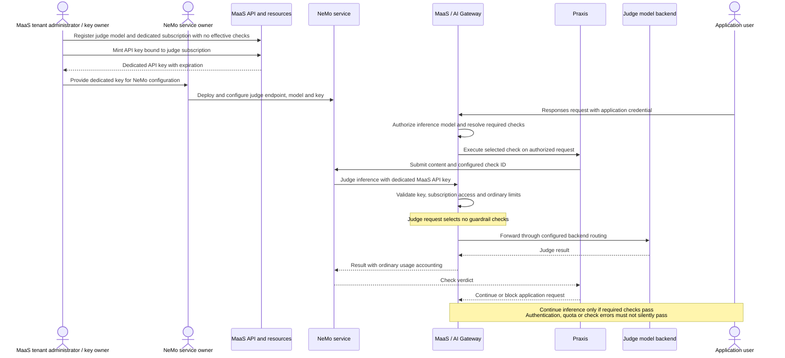

# Guardrails: API, Praxis compilation and reconciliation

|         |                                                       |
|---------|-------------------------------------------------------|
| Status  | Proposed                                              |
| Authors | Pierangelo Di Pilato, Christina Xu, Marius Ion Danciu |

This document defines guardrail attachment semantics, NeMo integration and compilation. It also owns the shared
AuthPolicy-to-Praxis contract, combined Responses/guardrails YAML, reconciliation lifecycle for this companion set.

Read alongside:

- [Responses and guardrails: high-level design](01-guardrails-responses-high-level-design.md)
- [Responses: enablement, storage and request lifecycle](02-responses-low-level-details.md)
- [Responses: future expansion and capability discovery](03-responses-future-expansion.md)

- [Guardrails: future expansion](04-guardrails-future-expansion.md)

In this document:

- [Reusable guardrail resources and attachments](#reusable-guardrail-resources-and-attachments)
- [Reference authorization, discovery and model applicability](#reference-authorization-discovery-and-model-applicability)
- [Attachment selection and composition](#attachment-selection-and-composition)
- [API validation and compatibility contract](#api-validation-and-compatibility-contract)
- [Resolution algorithm](#resolution-algorithm)
- [Model identity and conditional execution](#model-identity-and-conditional-execution)
- [Mapping to the NeMo API](#mapping-to-the-nemo-api)
- [Materializing MaaS configuration in Praxis](#materializing-maas-configuration-in-praxis)
- [TrustyAI integration and deployment topology](#trustyai-integration-and-deployment-topology)
- [Reconciliation and runtime lifecycle](#reconciliation-and-runtime-lifecycle)
- [Alternatives for delivering MaaS governance to AI Gateway](#alternatives-for-delivering-maas-governance-to-ai-gateway)
- [Reviews](#reviews)

## Reusable guardrail resources and attachments

Separate three responsibilities: TrustyAI's `NemoGuardrails` deploys a server and loads named configurations; a new
namespaced `AIGuardrail` defines an executable policy using that server; attachments on AITenant, MaasTenantConfig,
Model and Subscription determine where that policy runs. A reference to the server alone does not select its configs. A
policy is not directly coupled to users/groups: the selected subscription and existing MaaS authorization determine the
request's consuming scope.

`AIGuardrail` is proposed in `aigateway.opendatahub.io/v1alpha1`. AI Gateway owns its CRD integration, reconciliation
and status. The resource defines reusable provider checks independently of MaaS subscriptions. MaaS attachment fields
retain their existing shape and scoped lookup rules, but now refer to `AIGuardrail` without changing the public
attachment syntax. MaaS owns whether a tenant/model/subscription may attach a policy and how attachments compose. AI
Gateway owns whether the policy may use its provider and whether that provider binding is resolved. This split lets
other gateway consumers reuse AIGuardrail without implementing MaaS governance.

The [policy example](01-guardrails-responses-high-level-design.md#proposal-through-resource-examples) shows the proposed
AIGuardrail resource. Its provider and check contract is defined below.

`spec.provider.nemo.ref` is a typed reference to TrustyAI's namespaced
`NemoGuardrails`. The NeMo adapter uses the supported checks wire contract; no user-facing API-version selector is
required. An incompatible server fails provider readiness with an actionable reason. The server reference identifies
infrastructure, not a URL supplied by an inference caller. Credentials and CA references resolve only in the
`AIGuardrail` namespace. They are approved service-client credentials, not MaaS API keys. Initial policy creation
requires an authorized policy administrator; sharing a policy does not grant its consumers access to these Secrets.

Each `checks[]` entry has a unique name, one NeMo `configId`, and a nonempty phase set. Model dependencies belong to the
NeMo configuration and resolved provider binding; AIGuardrail exposes no model field. `checks`
is an ordered sequence of independent evaluations; all must pass. The resource is a reusable bundle, not an instruction
to invoke NeMo's undocumented multi-config merge semantics. Internally composed NeMo flows remain one config selected by
one entry. Do not allow attachment-level phase overrides to weaken the policy definition.

Allow authorized updates to `AIGuardrail.spec` in place. Kubernetes increments `metadata.generation`; AI Gateway must
revalidate changed checks, phases, provider references and applicability, then publish conditions for that generation
and a new accepted binding revision. Old conditions do not accept the new spec. Indexed watches trigger dependent MaaS
attachment revalidation, request-selection refresh and Praxis recompilation. A newly required protection must not leave
affected requests on an older, weaker configuration: fence admissions until a matching accepted generation is active.
Invalid updates leave affected combinations unavailable rather than silently dropping checks or reverting to old policy.
Already admitted requests follow the generation/drain contract, including cancellation where required for revocation.

This avoids mandatory reference changes across every model/subscription when policy evolves. Administrators may still
publish a separately named policy, such as `privacy-v2`, and migrate selected attachments for gradual adoption; this is
an optional rollout strategy, not an API immutability requirement. The version-like names in the examples are
illustrative.

Secret contents and discovered service endpoints can rotate independently of spec generation; include their validated
connectivity revisions in the binding contract. NeMo ConfigMaps are independently mutable: require versioned remote
configs and track observed revisions where available. Neither a local policy generation nor its digest alone proves
which configuration NeMo has loaded. Deleting/recreating a policy or provider with the same name still invalidates its
old UID references; it is not an in-place policy update or credential rotation.

All attachment locations use the same list of `ref + checks` entries. The
[resource examples](01-guardrails-responses-high-level-design.md#proposal-through-resource-examples) show tenant, model
and subscription model-entry attachments. [Selection and composition](#attachment-selection-and-composition) defines
all-checks and subset behavior; the [five-scope example](#five-scope-additive-selection) illustrates their union.

Attachments mean automatic execution, not an entitlement for inference callers to choose checks. API keys retain their
stored subscription binding. Subscription-selection priority remains unrelated to guardrail ordering.

### Platform and tenant-admin baselines

AITenant attachments belong to the platform administrator. MaasTenantConfig attachments belong to the tenant
administrator and apply to every MaaS-authorized request in that tenant, independently of the selected subscription.
Resolve the `default-tenant` singleton in the accepted tenant namespace; no arbitrary config name or caller-supplied
namespace selects this baseline. An empty local list adds nothing and cannot remove the AITenant baseline.

MaaS validates this singleton's references, publishes attachment readiness and refreshes request-selection state when it
changes. A missing or unresolved singleton must not be interpreted as an empty baseline for an active MaaS tenant; fail
affected authorization until MaaS configuration is ready. Preserve both baselines' provenance when they select the same
check. AI Gateway neither reads MaasTenantConfig nor waits for its status: all selected checks still come from its
independently compiled AIGuardrail catalog.

## Reference authorization, discovery and model applicability

These are separate contracts and must not be represented by one config-ID subset:

| Contract             | Meaning                                                                                         |
|----------------------|-------------------------------------------------------------------------------------------------|
| Reference permission | This source namespace/resource kind may attach the target policy or use the target NeMo service |
| Applicability        | The policy can evaluate this model, protocol, modality and phase                                |
| Enforcement          | The selected request must execute the effective selected checks                                 |

### Scoped policy references

Policy lookup is constrained by the resource carrying the attachment. The AITenant target namespace means its accepted
`status.tenantNamespace`, not the namespace containing the AITenant object.

| Attachment resource                                         | Reference shape and enforced target                                                                                                                                                                 |
|-------------------------------------------------------------|-----------------------------------------------------------------------------------------------------------------------------------------------------------------------------------------------------|
| `MaaSSubscription`, including `spec.modelRefs[].guardrails` | `ref.name` only. `ref.namespace` is forbidden, even if it equals the tenant namespace. Always resolve in the AITenant target namespace.                                                             |
| `MaasTenantConfig`                                          | `ref.name` only. `ref.namespace` is forbidden. Always resolve in the AITenant target namespace.                                                                                                     |
| `MaaSModelRef`                                              | Explicit `ref.name` and `ref.namespace`. Namespace must equal either the MaaSModelRef's own namespace or the AITenant target namespace. No other namespace is allowed, even within the same tenant. |
| `AITenant` | `ref.name` only. `ref.namespace` is forbidden. Always resolve in its accepted target namespace, not the namespace containing the AITenant object. |

There is no search, inferred fallback or precedence between the two model choices: resolve
exactly the selected target. A subscription model entry follows the subscription rule, not the MaaSModelRef rule.
Validate authoritative same-tenant membership and pin tenant, namespace and policy UIDs. Failed, ambiguous or changed
membership makes attachments unresolved; caller-provided names or self-assigned labels cannot establish membership. AI
Gateway validates AITenant attachments; MaaS validates MaasTenantConfig/model/subscription attachments.

Model-namespace AIGuardrails keep credentials and CA references local to their own namespace. Their NeMo provider must
explicitly permit that namespace through `allowedConsumers`; permission for the tenant namespace alone is insufficient.
Policy editors may publish resources without exposing their Secrets to attachment editors.

**Catalog discovery prerequisite:** the worked compiler currently discovers the AITenant target namespace. Supporting
model-local policies also requires an authoritative association between model namespaces and the AI Gateway tenant,
available independently of MaaS resource watches or acceptance status. The publication/discovery mechanism for that
association is an open design decision. A model-local attachment is not ready until its accepted check is in the
published tenant catalog; never silently skip it or fall back to a tenant-namespace policy with the same name.

```yaml
kind: MaaSModelRef
spec:
  guardrails:
    - ref:
        name: privacy-v1
        namespace: <tenant-namespace>
      checks: [ ]
```

These lookup rules avoid copying policies, credentials or NeMo permission assumptions between namespaces. The model
deployer may reference a policy without permission to edit it or read its Secrets. Namespace membership and RBAC remain
administrator-controlled; policies in another tenant are not selectable. Cross-namespace provider references remain a
separate NeMo-owned permission check below.

### NeMo-owned consumer permission

`AIGuardrail.spec.provider.nemo.ref` retains `name` and optional `namespace` because NeMo can live in a separate
infrastructure namespace. Omission resolves in the AIGuardrail namespace. The referenced NeMo resource authorizes
attachments through a proposed `spec.allowedConsumers`, analogous to Gateway API's target-owned `allowedRoutes`. This
replaces a ReferenceGrant for the policy-to-NeMo edge; the two mechanisms are not cumulative requirements.

Proposed TrustyAI resource fragment (new field, not currently implemented):

```yaml
kind: NemoGuardrails
spec:
  allowedConsumers:
    namespaces:
      from: Selector
      selector:
        matchLabels:
          kubernetes.io/metadata.name: team-a
```

The consumer is specifically an `aigateway.opendatahub.io/AIGuardrail`. No configurable kind list is introduced
initially. Evaluate the namespace of that policy resource, not the tenant object, model, subscription, runtime Pod or
inference caller. The permission check uses the AIGuardrail's actual namespace, which can be the tenant target or model
namespace. The policy's authorized reuse within its tenant is governed by the scoped attachment contract above.

| `namespaces.from` | Exact permission semantics                                                                                                                                         |
|-------------------|--------------------------------------------------------------------------------------------------------------------------------------------------------------------|
| `Same`            | Only AIGuardrail resources in the NemoGuardrails resource's namespace may reference it. Default when `allowedConsumers`, `namespaces` or `from` is omitted         |
| `Selector`        | Only AIGuardrail resources whose Namespace object's labels match the specified Kubernetes LabelSelector may reference it; same-namespace consumers must also match |
| `All`             | Any namespace, including the NeMo namespace, satisfies this attachment check. Explicit opt-in; no selector is accepted                                             |

`Selector` requires a nonempty selector with at least one `matchLabels` entry or `matchExpressions` requirement. Reject
an absent or empty selector rather than interpreting it as allow-all; users must choose `All` explicitly. This is a
stricter validation choice than the general empty Kubernetes LabelSelector semantics. `selector` is forbidden with
`Same` or `All`, including when `from` defaults to `Same`; invalid combinations are rejected, not silently ignored.
Unknown modes and invalid selector operators/values are validation errors.

Use standard Kubernetes LabelSelector matching: all `matchLabels` equalities and all `matchExpressions` requirements are
ANDed. `In` requires the label to exist with one listed value; `NotIn` matches absent labels or values outside the list;
`Exists` requires presence; `DoesNotExist` requires absence. `In`/`NotIn` require nonempty values; `Exists` and
`DoesNotExist` require no values. There is no OR between separate requirements. A missing Namespace object or failed
lookup never matches. Selectors match namespace labels, not labels on the AIGuardrail.

For an exact namespace, use the `kubernetes.io/metadata.name` label as above. For a set of namespaces:

```yaml
kind: NemoGuardrails
spec:
  allowedConsumers:
    namespaces:
      from: Selector
      selector:
        matchExpressions:
          - key: kubernetes.io/metadata.name
            operator: In
            values: [ team-a, team-b ]
```

To deliberately allow attachments from all namespaces:

```yaml
kind: NemoGuardrails
spec:
  allowedConsumers:
    namespaces:
      from: All
```

`All` relaxes only this server-owned attachment check. It does not approve the endpoint for every tenant, expose
Secrets, authorize model execution, select permissible NeMo configs or bypass service authentication. With the initial
contract, it permits every eligible policy in an allowed namespace to reference that server; per-config delegation would
need a separate future contract. Tenant/platform admission must still approve the exact provider namespace/name and
selected configurations. Shared-server cross-tenant config isolation is not supplied by this field.

NeMo owners control `allowedConsumers`; only trusted platform administrators may control labels used for authorization.
If policy authors can label their own namespaces to satisfy a selector, that selector is not an independent
authorization boundary. Namespace-name selectors avoid granting access through arbitrary self-assigned labels.

TrustyAI defines the API field and validates its shape. AI Gateway evaluates `allowedConsumers`, provider-reference
validity and gateway/platform provider restrictions when reconciling `AIGuardrail`, and publishes its accepted binding.
MaaS consumes that status, enforces its scoped attachment and tenant-approval rules, and composes effective policy. MaaS
does not re-evaluate NeMo consumer permission or resolve provider credentials. AI Gateway then compiles the tenant-local
catalog using the matching binding revisions, independently of MaaS attachment status. The
[resource/status gates](#resource-events-and-status-gates-between-components) define when compilation and activation are
permitted. Until that contract is implemented, cross-namespace NeMo binding remains unavailable; an unknown or ignored
field is not permission. AI Gateway records provider/policy/Namespace UIDs and evaluated permission revisions in its
binding publication. It watches NeMo permissions, provider namespace labels/identity and provider/policy recreation;
MaaS watches tenant membership and attachment scope changes. Denial sets
`ResolvedRefs=False` with an actionable reason and blocks affected plans through the existing propagation fence; never
replace the check with an empty policy. `All` does not require namespace-label watches for matching, but namespace
identity, tenant membership and provider approval still require validation. Tightening permission fences new admissions;
already admitted requests follow the documented generation/drain contract, not a claim of instantaneous cancellation.

Publish an authorized policy catalog containing reference identity, description, phase/protocol coverage, applicability
and readiness. Model publishers need these names and capabilities, not the NeMo URL or private ConfigMap contents.
Exposing
`MaaSModelRef.status.guardrailsUrl` is unnecessary for policy attachment and does not solve reference permission. Policy
status can report sanitized `Accepted`,
`ResolvedRefs`, `ProviderReady` and `Compatible` conditions; do not expose credentials or private subscription
provenance through model status.

A NeMo configuration owns the models used by its rails. Checks mode evaluates supplied content rather than generating
the application's answer, although self-check or detector rails may themselves call models. A configuration's main model
is not necessarily a dedicated evaluator, and it is not an allowlist of originating MaaS inference models. Model access
and model-specific applicability remain with request authorization. AIGuardrail does not need a model field or a
MaaSModelRef reference for gateway reconciliation.

The [NeMo wire contract](#mapping-to-the-nemo-api) supplies the fixed request value `check-model`. Each LLM-based
rail uses its explicit task model from NeMo configuration; no per-config model discovery or public MaaS alias
substitution is needed. Unsupported or missing task bindings leave the check unavailable. NeMo owns config parsing;
AI Gateway does not parse arbitrary ConfigMaps to derive model authorization.

## Attachment selection and composition

All five attachment locations use a list of entries containing `ref` and optional `checks`:

```yaml
kind: MaaSSubscription
spec:
  guardrails:
    - ref:
        name: application-safety-v1
      checks: [ application-check ]
```

`ref.name` and the namespace resolved by the [scoped reference rules](#scoped-policy-references) identify an
AIGuardrail; there is no attachment-level alias. `checks` contains names from that resource's `spec.checks`, not NeMo
config IDs. Omitted `checks` or `checks: []` selects every check in the resource. A nonempty list selects only the named
checks. Reject unknown or duplicate names and explicit `null`. Selection never changes a check's provider, configuration
or phases, and selector-list order does not change execution order.

All-checks attachments track the accepted resource contents: adding a check enables it for those attachments after
validation and activation. Explicit subsets do not adopt newly named checks automatically; edits to an already-selected
check still apply. Removing or renaming an explicitly selected check makes the attachment unresolved and fails closed.
The AIGuardrail itself must always contain at least one check.

For an authorized tenant/model/subscription request, collect the lists on AITenant, MaasTenantConfig, MaaSModelRef, the
selected MaaSSubscription and its matching model entry. Expand each attachment's selection and take their union. Every
selected check must pass; a scope cannot subtract checks attached by another scope. Deduplicate by
`(namespace, AIGuardrail name, check name)`, preserving the source resource UID, attachment path and referenced policy
identity for every origin. Multiple entries referencing the same policy contribute a union; an all-checks entry includes
all its checks even if another entry selects a subset.

An absent `guardrails` or `guardrails: []` contributes no local attachments and does not remove checks from another
scope. This differs from `checks: []` inside an attachment, which selects all checks from its referenced resource. All
initial attachments enforce and fail closed. There is no `required`, `defaults`, override mode or global disable field
in the initial API. [Required/default composition](04-guardrails-future-expansion.md) is deferred.

## API validation and compatibility contract

The sketches span the MaaS resources, proposed AI Gateway APIs and TrustyAI provider integration. Adding these fields
still requires generated CRDs, defaulting/validation and controller support in the owning component. Do not use an
opaque Praxis YAML field as the user-facing policy API. Unknown policy fields must produce actionable validation errors
rather than being silently interpreted as an unguarded request.

In the table, **attachment resources** means the following five locations, all using the same `ref + checks` shape:

- `AITenant.spec.guardrails[]`
- `MaasTenantConfig.spec.guardrails[]`
- `MaaSModelRef.spec.guardrails[]`
- `MaaSSubscription.spec.guardrails[]`
- `MaaSSubscription.spec.modelRefs[].guardrails[]`

Fields labeled as attachment fields are relative to an entry in one of these lists. Arrows in the resource column
identify cross-resource validation, from the referencing resource to its target; they do not imply controller ownership.

| Resource(s)                                             | Field or combination                                                                     | Proposed validation/default                                                                                              |
|---------------------------------------------------------|------------------------------------------------------------------------------------------|--------------------------------------------------------------------------------------------------------------------------|
| `AITenant`                                              | `spec.responses` absent or `spec.responses.enabled` omitted                              | Disabled; `enabled` defaults to false                                                                                    |
| `AITenant`                                              | `spec.responses.enabled: true` without `spec.responses.storage`                          | Invalid; no implicit ephemeral storage                                                                                   |
| `AITenant`                                              | `spec.responses.storage`: `PlatformDefault` with override/managed fields, or mixed modes | Invalid discriminated union; future modes rejected until supported                                                       |
| `AITenant`                                              | `spec.responses.enabled: false` with retained configuration                              | Valid staged configuration; no Responses endpoints become available                                                      |
| `AITenant`                                              | `spec.responses.retention.maxAge`                                                        | Required positive duration when enabled; no undocumented unlimited-retention default                                     |
| `AITenant`                                              | `spec.responses.storage.deletionPolicy`                                                  | Initially only `Retain`; destructive deletion needs a later explicit contract                                            |
| `AITenant`                                              | `spec.responses.enabled: true`                                                           | Enables Responses and Conversations together; readiness requires both API surfaces                                       |
| `MaaSModelRef`                                          | `spec.capabilities.responses` or its enclosing fields/`mode` omitted                     | Effective mode is `ChatCompletions` for every backend kind; tenant enablement and compatibility checks still apply       |
| `MaaSModelRef`                                          | `spec.capabilities.responses.mode: Unsupported`                                          | Responses unavailable for this model regardless of tenant enablement; preserve unrelated model APIs                      |
| `MaaSModelRef`                                          | `spec.capabilities.responses.mode: Native`                                               | Explicit native backend declaration; validate compatibility before activation                                            |
| `AITenant` and attachment resources                     | `spec.payloadProcessing.type: ipp` with guardrail attachments                            | Invalid until that backend implements the same enforcement contract                                                      |
| `AIGuardrail`                                           | `spec.checks`                                                                            | Nonempty ordered list; local check names unique                                                                          |
| `AIGuardrail`                                           | `spec` update                                                                            | Mutable with authorization/revalidation, current observedGeneration and a new binding revision; fence unsafe transitions |
| `AIGuardrail`                                           | `spec.checks[].configId`                                                                 | Required nonempty string; selected configuration loaded by NeMo                                                          |
| `AIGuardrail` → `NemoGuardrails` | Required task model binding missing or unusable | Check unavailable; no fallback to the request main model |
| `AIGuardrail`                                           | `spec.checks[].phases`                                                                   | Nonempty set containing only `Input` and/or `Output` initially                                                           |
| Attachment resources                                    | Attachment-level phase/config override                                                   | Invalid; settings belong to the referenced policy                                                                        |
| `AIGuardrail`                                           | `spec.provider.nemo.ref.namespace` omitted                                               | AIGuardrail namespace                                                                                                    |
| Attachment resources                                    | Policy ref missing `name`                                         | Invalid; `name` is required                                                                   |
| `MaaSSubscription`, `MaasTenantConfig`                  | Policy reference, including subscription model entries                                   | `ref.name` only; reject any `ref.namespace`; always use the AITenant target namespace                                    |
| `AITenant` | Policy `ref.namespace` | Forbidden; resolve `ref.name` in the accepted AITenant target namespace |
| `MaaSModelRef`                                          | Policy `ref.namespace`                                                                   | Required; only the MaaSModelRef namespace or AITenant target namespace is allowed                                        |
| Attachment resources                                    | Policy namespace outside the source resource's permitted targets or tenant               | Invalid/unresolved; validate authoritative membership, no namespace fallback                                             |
| `AIGuardrail` → `NemoGuardrails`                        | `spec.provider.nemo.ref` denied by target `spec.allowedConsumers`                        | Invalid/unresolved; never drop the check                                                                                 |
| `AIGuardrail`                                           | `spec.provider.nemo.ref` outside tenant/platform approval                                | Unresolved/invalid even when allowedConsumers permits attachment                                                         |
| `MaaSSubscription`                                      | Duplicate `spec.modelRefs[]` namespace/name key                                          | Invalid; one matching entry per model                                                                                    |
| Attachment resources                                    | Attachment `checks` omitted or empty                                                     | Select all checks; follow validated additions to the referenced AIGuardrail                                              |
| Attachment resources                                    | Nonempty attachment `checks`                                                             | Select named checks; reject duplicates, unknown names and null                                                           |
| Attachment resources                                    | `guardrails` omitted or empty                                                            | No local contribution; other scopes still apply                                                                          |
| Attachment resources → `AIGuardrail` → `NemoGuardrails` | A missing policy/provider                                                                | Reject affected requests; never remove the unresolved check                                                              |

Guardrails can operate on Chat Completions while Responses is disabled. Enabling Responses is not a prerequisite for
guardrails. Conversely, enabling Responses does not invent a default NeMo provider: an empty effective policy means no
content checks, with that fact visible to authorized administrators.

Policy `spec.checks` is an atomic ordered list with unique names; its order determines execution. Attachment lists are
atomic lists as well, with no alias or list-map key. Attachment `checks` is a set of unique names whose order has no
execution effect. Phase lists are sets. Conflicting edits must not silently overwrite another field manager's policy.
Explicit `null` is invalid and cannot erase another scope's contribution.

Policy spec updates increment generation; provider credentials and discovered connectivity can rotate without a spec
update. Track policy identity/content and connectivity revisions separately in the accepted binding. A changed data
destination still requires authorization, capability validation and acknowledgment; changing credentials must not alter
which checks run.

Do not add placeholder production defaults for timeout, retention, request bytes or loop count merely by copying example
values. Before generating CRDs, choose bounded platform defaults and maxima through capacity planning. Tenant settings
may reduce limits; raising platform maxima requires platform authority. The concrete `5s` and `168h`
values in this document are examples of explicit settings.

## Resolution algorithm

Resolve from a consistent snapshot of admitted resources, validated tenant membership and current AI Gateway-accepted
provider bindings. MaaS resolves its attachments; it does not resolve NeMo credentials or consumer permission.

```text
resolve(tenant, maasTenantConfig, model, selectedSubscription, snapshot):
    assert model and selectedSubscription belong to tenant
    assert selectedSubscription is authorized for this model and principal
    entry = unique selectedSubscription.modelRefs entry matching model
    assert maasTenantConfig is the accepted default-tenant singleton in tenant.namespace
    attachments = tenant.guardrails + maasTenantConfig.guardrails + model.guardrails
                  + selectedSubscription.guardrails + entry.guardrails
    selected = empty set
    for attachment in attachments:
        namespace = resolve attachment namespace using its source resource and accepted tenant identity
        policy = resolve exact namespace/attachment.ref.name in tenant catalog
        assert current accepted policy UID, generation and provider binding in snapshot
        names = attachment.checks if nonempty else all policy.spec.checks names
        assert every selected name exists
        add names to selected by (policy.namespace, policy.name, check.name), preserving origins
    plan = sort selected by policy.name, then policy.namespace, then check index in policy.spec.checks
    validate selected checks against model, protocol, modality and runtime capabilities
    return immutable plan with UIDs, revisions and provenance
```

Absent local attachment lists normalize to empty lists. Authorization happens before selection. Reject unresolved
references, unknown check names and unsupported selected checks; never drop them or switch to a weaker subscription.

### Deterministic check ordering

Initially, ordering is deterministic and not configurable. Sort AIGuardrails by Kubernetes resource name in ascending
bytewise lexical order, use namespace as the lexical tie-breaker for equal resource names, then preserve
`spec.checks[]` order within each resource. Apply that order separately to Input and Output, skipping checks not
selected or not configured for that phase. A selected check executes once per phase, even when several attachment scopes
require it. Attachment selection determines membership, not execution order.

This is safe only for independent allow/block checks: every check in a phase receives the same canonical content and
cannot transform it or depend on another check's side effects. All selected checks must pass; ordering affects callout
latency and the first reported failure, not the aggregate allow decision. No priority field or cross-policy dependency
is introduced. Redaction-before-evaluation, stateful sequencing and other transformations require a separate execution
contract and remain unsupported initially. Referencing such a configuration must not silently assume lexical ordering
satisfies its dependencies.

AI Gateway configures the tenant's catalog in this order without knowing MaaS subscriptions. Selection headers only turn
checks on or off. MaaS can derive the same expected order from AIGuardrail names and check lists. Reverse response
traversal must not invert Output order: emit separate phase entries with reversed Output-entry placement when needed.
Policy names, check names, check-list order and binding revisions contribute to the configured catalog revision.

Sequential fail-fast evaluation is the initial contract. The first block produces a content rejection; the first
evaluation error produces a service failure. No later checks run after either outcome. This prioritizes deterministic
execution and bounded callout cost. Running checks concurrently would need a separate decision about result precedence,
cancellation and potentially stateful NeMo actions.

With `N` distinct phase-matching selected checks, one boundary performs at most `N` evaluations. One binding can expand
into several checks; bound both binding count and total expanded checks. An agentic loop multiplies this by its
evaluated boundaries; policies with their own detector calls can add more work. Enforce both per-provider concurrency
and a request-wide deadline. Each call gets the smaller of its configured timeout and the remaining request deadline.
Queue exhaustion is an evaluation failure, not permission to bypass a check. Do not automatically retry NeMo calls until
their action-side-effect/idempotency contract is established.

## Model identity and conditional execution

Guardrail execution must follow the authorized model and selected subscription. Multiple models can share the same
`/v1/chat/completions` or `/v1/responses` endpoint, with the model identifier supplied in the request body, so path
conditions alone cannot select the correct policy.

Administrators attach policies to tenant, model and subscription resources; the compiler translates the resolved policy
into conditional Praxis execution. Model extraction, authorization and routing must agree on the identity used to select
that execution. Do not expose arbitrary payload predicates as a second policy-selection API.

The same canonical identity must connect classification, authorization, policy and routing:

1. Parse the supported request format with bounded size/depth and extract the model identifier before any
   content-dependent outbound work. Treat all client-supplied routing/model headers as untrusted. Malformed or ambiguous
   identifiers fail rather than selecting a default model.
2. Resolve the identifier to one tenant-scoped `MaaSModelRef` and its UID. If both the route/path and body identify a
   model, require them to resolve to the same object; reject a mismatch before NeMo or inference. Routes that merely
   identify an API operation do not themselves supply a competing model identity.
3. Authenticate and authorize that canonical model with the selected subscription. Select its unique subscription model
   entry and resolve the effective guardrails.
4. Carry the authorized model UID, subscription UID and plan generation through protected internal metadata. Praxis
   dispatch uses this context, not a second independent comparison of the raw client model string.
5. Permit serialization to replace a public alias with the resolved backend model name, provided it preserves the
   authorized logical model and approved backend mapping. Translation, retry or routing that changes the logical model
   requires fresh authorization and policy resolution before the new call. If the runtime cannot do so, reject the
   change rather than reusing the previous model's plan.

Distinct aliases may identify the same logical model, but collisions resolving to multiple model UIDs are invalid.
Backend replicas of the same approved model do not require different policies merely because a load balancer picks
another pod. A provider/model failover that changes the policy-relevant backend contract requires compatibility
validation; it cannot use an unchecked fallback pool.

This applies on every agentic iteration. A tool or model output cannot overwrite the protected model identity. Bodyless
stored-object operations follow
the [ownership and stored-model lookup rules](02-responses-low-level-details.md#request-processing-and-responses-ownership);
they must not infer a model from an absent payload.

## Mapping to the NeMo API

Use `POST /v1/checks` for independent content evaluation. MaaS inference routing, credentials, accounting and Responses
persistence remain in the gateway. The request's `model` is the fixed compatibility value `check-model`; it does not
select the MaaS inference backend or the model used by a guardrail task. No model field is exposed on AIGuardrail.

### Task-specific model ownership

The NeMo configuration explicitly binds every LLM-based rail task to its model, provider and connection settings.
For example, `self check input` selects the model configured under `type: self_check_input`. A local blocklist check
does not invoke a model. The same policy can check content from different MaaS inference models without changing its
own model bindings.

The following ConfigMap fragment illustrates the agreed flow. The NeMo owner also supplies the `check blocklist` flow
implementation and the self-check prompt; naming those flows alone does not define them. Register the completed bundle
as `maas-input-check` through `NemoGuardrails.spec.nemoConfigs` in the approved infrastructure namespace.

```yaml
apiVersion: v1
kind: ConfigMap
metadata:
  name: maas-input-check-config
  namespace: <guardrails-namespace>
data:
  config.yaml: |
    models:
      - type: self_check_input
        engine: openai
        model: meta-llama/Llama-3.1-8B-Instruct
        parameters:
          base_url: <maas-gateway-model-base-url>
          api_key: <dedicated-judge-subscription-api-key>
    rails:
      input:
        flows:
          - check blocklist
          - self check input
```

The model, endpoint and key above are placeholders. For 3.6, use the
[judge-model API-key flow](#judge-model-authentication-for-36) and verified TLS. NeMo owns those credentials,
the task model's lifecycle and the downstream destinations. They are separate from Praxis's credentials for calling
NeMo. Output checks that invoke an LLM need their own explicit task binding.

The supported NeMo runtime must route each LLM-based rail to its explicit task model, with no implicit fallback to the
request-selected main model. Missing task bindings, initialization failures or unavailable dependencies make the check
unavailable. The fixed `check-model` value must never be invoked as a fallback model. This includes any main-model
initialization performed while loading the configuration; do not assume a schema-valid request guarantees a usable
configuration. Non-LLM-only checks need no invented task model.

Use request IDs and existing trusted model metadata for correlation. Sending the original inference-model name in this
field is unnecessary and may affect main-model overrides or the NeMo configuration cache. Model discovery and a
`configId → model` mapping are no longer prerequisites: task models stay in NeMo, and changes to the config invalidate
its observed binding revision through the normal publication lifecycle.

### Checks request and verdict contract

For an Input check, Praxis sends:

```json
{
  "model": "check-model",
  "messages": [{"role": "user", "content": "Hello"}],
  "guardrails": {
    "config_ids": ["maas-input-check"]
  }
}
```

Use exactly one config ID per call, even though the field is a list. Expand MaaS selections into independent check
calls; do not delegate cross-policy composition to NeMo's multi-config merging. A single NeMo configuration may contain
several internally ordered flows, as above. The existing proposed Praxis `provider.config_id` remains singular and is
serialized as the one-element wire `guardrails.config_ids` list.

NeMo selects rails by message role: user/system messages use input rails, assistant messages use output rails, and tool messages use tool-input
rails. Praxis's existing `phase.request/response` controls **when the filter runs**, not which NeMo rails run. In particular,
a request containing assistant history can invoke output rails too; setting `phase.request: true` does not force input-only
execution. The adapter must prepare boundary-appropriate messages and validate that the selected configuration covers
the intended checks. Compositions requiring phase isolation that this role-based contract cannot express remain unsupported;
do not silently reinterpret roles or skip protected content. Responses-aware message extraction remains proposed work.
Do not accept client-supplied config selection, model overrides, inline configurations or rail options from the inference
request.

The response uses `status` and `rails_status`, with optional `guardrails_data`. Retain the current Praxis adapter's
`success` → pass and `blocked` → sanitized content rejection mapping. Error or unknown statuses, malformed responses,
missing configs, non-2xx responses and timeouts fail closed. Validate the required response fields before accepting a pass;
the current adapter treats `rails_status` as optional, so enforcing the supplied OpenAPI contract requires stricter parsing.
Do not expose internal error details through failure diagnostics. Output must remain gated until the verdict is accepted.

The endpoint and verdict convention already match the existing Praxis NeMo adapter. Config selection and the integration
changes below are still required; accepting the existing endpoint URL does not make the complete example executable.
This contract uses the supplied NeMo OpenAPI and the inspected role-based checks handler.

Use dedicated service credentials and verified TLS for callouts; never forward MaaS API keys. Permit approved private
endpoints without disabling egress protection globally. A task model must not route recursively through the same gateway
guardrails. Model-backed check usage is separate from application inference usage.

## Materializing MaaS configuration in Praxis

The capability and configuration baseline for this design is the inspected local `praxis` and `praxis-ai` implementation
and examples, referenced below. The versions currently pinned by `praxis-extproc` do not constrain the architectural
proposal; dependency alignment belongs to scoped implementation deliverables. Distinguish existing Praxis features, MaaS
integration work and optional Praxis extensions rather than treating a dependency mismatch as a missing feature.

Conversations, file-search callouts, MCP discovery/dispatch and iterative execution already have Praxis implementations.
Their service bindings, authorization, limits and composition still need to be expressed by the tenant configuration.
Existing configuration examples are the starting point; fields proposed by this ADR remain explicitly labeled.

### Compilation and request authorization

AI Gateway configures the available checks; MaaS selects which checks an authorized request must execute. These are
separate contracts. AI Gateway depends only on its AITenant/AIGuardrail resources and provider/storage inputs for this
flow. It does not read MaaSSubscription/MaaSModelRef guardrail declarations, wait for MaaS validation status, or call
MaaS to build its filter catalog. MaaS request authorization remains part of the request path.

| Component              | Responsibility                                                                                                          | Output                                                                              |
|------------------------|-------------------------------------------------------------------------------------------------------------------------|-------------------------------------------------------------------------------------|
| AI Gateway controller  | Resolve AITenant and all tenant-local AIGuardrails; validate provider references; compile checks in deterministic order | Configured catalog, binding revisions, readiness and generated Praxis configuration |
| MaaS controller/API    | Manage MaaS attachments and access/limits policy; resolve additive check selection for the current request              | Verified selected check identifiers and ownership context through AuthPolicy        |
| AuthPolicy integration | Authenticate/authorize before protected work and inject only verified decision headers                                  | Selection flags, expected catalog revision and owner identity                       |
| Praxis                 | Check catalog compatibility and execute selected checks in configured order; enforce Responses ownership                | Guardrail evaluation, inference, Responses persistence and release                  |

**Discovery and compilation.** AITenant identifies one authoritative tenant namespace. AI Gateway watches its
AIGuardrails, configures each accepted resource's checks and projects approved provider credentials privately. It also
watches AITenant changes and provider/Secret dependencies through the relevant reconciler. An AIGuardrail change or
removal changes the catalog; a MaaS attachment change selecting already-configured checks does not require gateway
recompilation. An invalid guardrail remains unavailable and cannot be selected successfully; unrelated accepted checks
can remain configured. Creating an AIGuardrail does not expose an inference route or make it mandatory for every
request. No AIGatewayPolicy or MaaS HTTP configuration endpoint is needed initially.

<a id="guardrail-check-identifier"></a>

**Check identity.** Every check uses the same derivation, regardless of where it is attached:

```text
RENDER_CHECK_ID(namespace, guardrail, check) =
    lowercase_hex(SHA-256(UTF-8(compact_JSON([namespace, guardrail, check]))))

header_name = "x-aigateway-guardrail-" + RENDER_CHECK_ID(namespace, guardrail, check)
```

The inputs are the AIGuardrail's namespace, `metadata.name` and `spec.checks[].name` (not the NeMo config ID). Compact
JSON has no separator whitespace; preserve the exact input strings. All consumers use the same encoding. In the YAML
examples, `RENDER_CHECK_ID(<tenant-namespace>,guardrail,check)` denotes a compiler substitution using the shown
resource/check names. It is documentation notation, not a Praxis expression or a literal HTTP header name. Resolve the
namespace placeholder and replace the whole expression with the digest before publishing configuration. There are N
distinct headers for N configured checks, and repeated references to the same check reuse one header.

**Length and hashing cost.** The rendered header name is always 86 ASCII bytes: the 22-byte prefix plus the full
64-character lowercase SHA-256 digest. Long valid resource/check names do not lengthen it; never truncate the input
names or digest. Apply resource/schema length limits before hashing. The readable expressions in the examples do not
appear on the wire. Bound both catalog size and aggregate selection-header bytes for the selected gateway/host; a fixed
name length alone does not bound the number of headers. Reject an oversized configuration rather than omit checks.

Compute identifiers when catalog/configuration changes and cache the tuple-to-ID mapping for request selection; requests
need not rehash names. Keep SHA-256 rather than MD5: these identifiers distinguish enforcement checks, so collision
resistance is useful even though the hash does not authenticate the request. MD5 is unsuitable when collision resistance
is required ([RFC 6151](https://www.rfc-editor.org/rfc/rfc6151.html#section-2)). A possible hash-speed difference is not
a reason to weaken this configuration-time contract. Preserve the original tuple and reject conflicting digest
assignments before publication; never merge different checks because their hashes match. This shared encoding contract
does not mandate where resolver code lives. Resource UID, generation and binding revision identify the version of the
check, not its selection key. In-place updates retain the key; rename changes it; deleting/recreating a resource
invalidates old UID/revision expectations. Header identifiers contain neither subscription identity nor attachment
order.

**Request selection and safety.** MaaS combines AITenant/MaasTenantConfig/model/subscription attachments using additive
selection, deduplicates selected check keys and requires them all in the available catalog. Only authenticated
authorization output may set flags; caller copies are rejected. Praxis validates the trusted selection against its
catalog before protected work; unknown or unavailable checks reject the request rather than disappear through
nonmatching conditions. MaaS is responsible for producing the complete mandatory set: the gateway does not reconstruct
MaaS policy to infer missing requirements. Guardrail flag presence alone is not evidence that authorization occurred.

**Revision consistency.** AI Gateway publishes the configured tenant catalog revision covering tenant identity and each
configured AIGuardrail UID/generation, binding revision, check identity, phase and deterministic order. Runtime-only
acknowledgments and volatile status timestamps do not change the content digest. MaaS obtains that catalog and verifies
selected checks against current desired AIGuardrails; it must not authorize a changed required check using an older
ready catalog. The trusted request decision names the catalog revision it expects. Praxis initially requires an exact
match with its loaded revision before protected work. MaaS attachment changes affect selection flags, not the catalog
revision, when check definitions are unchanged. Identity, eligibility and revocation caches still require bounded
invalidation. Missing, stale or incompatible catalog/decision state fails closed; no synchronous controller handshake is
required. Complete catalog equality is conservative and may briefly block unaffected requests during updates; a more
selective compatibility rule is future work.

**Responses.** AITenant enablement determines lifecycle-filter presence and storage binding. MaaS still authorizes each
operation and supplies owner/model context where required. A positive authorization cannot enable missing
infrastructure. The existing worked routing/model-adapter placeholders represent separately validated model integration,
not a reason for the guardrail compiler to traverse MaaS policy resources. Standalone Praxis supplies the same
authorization and catalog contracts with its own transport. Alternative handoffs are discussed in
[governance handoff alternatives](#alternatives-for-delivering-maas-governance-to-ai-gateway).

### Compiler inputs and outputs

| Input                                                                  | Final materialization                                                                                            |
|------------------------------------------------------------------------|------------------------------------------------------------------------------------------------------------------|
| Tenant backend/Gateway selection                                       | Target runtime deployment and mounts; initially pre/post ExtProc and EnvoyFilter, later standalone listeners     |
| Model/provider resolution                                              | Bounded model extraction and authorized routing/credentials; Envoy mutations/routes or standalone Praxis routing |
| Selected-subscription contract                                         | Trusted-context Praxis filter settings for allowed tenant/model/subscription tuples                              |
| Five attachment locations and reference permissions                    | MaaS resolves additive selections; AI Gateway configures the tenant catalog independently                        |
| `AIGuardrail.spec.provider.nemo.ref`                                   | Discovered checks endpoint, dedicated credentials/CA mounts and resolved provider identity                       |
| Policy check `configId`, `phases` and fixed `check-model` | One-element NeMo config list, filter execution phases and existing Praxis model setting |
| Responses enablement/storage                                           | Store, validation, rehydration and protocol filters; DB Secret/CA mounts, migration/retention lifecycle          |
| Optional agentic capability                                            | Supported Praxis iterative subpipeline, per-boundary checks and explicit subrequest bindings/limits              |
| Resource/config/permission revisions                                   | Generation encoded in runtime configuration and deployment status; stale-generation rejection                    |

Connection URLs and credentials use private Secret mounts. `RENDER_*` values in the example are compiler placeholders.
Pre-auth classification failure must reject authorization; it cannot select a default model or bypass its guardrails.

### Relationship to MaaSAuthPolicy and the generated gateway AuthPolicy

`MaaSAuthPolicy` remains the public model-access policy. In the initial ExtProc deployment, MaaS generates the Kuadrant
`AuthPolicy` evaluated by the gateway's authentication/authorization integration, including MaaS API selection from the
accepted configuration. Praxis consumes the successful result before processing Responses and guardrails.

In standalone deployments, authentication and authorization move into Praxis, which evaluates credentials and enforces
the MaaS access/subscription contract before invoking protected filters. Compilation must supply that authentication and
authorization configuration as well as the Responses/guardrail filters; the Kuadrant AuthPolicy below is specific to the
ExtProc deployment. Both targets produce the same verified ownership header for the stateful filters. Matching that
header in a downstream filter selects behavior; credential verification and access decisions belong to the preceding
authentication/authorization stage. No new user-facing `MaaSAuthPolicy` identity field is proposed.

The existing generator in `maas-controller/pkg/controller/maas/maasauthpolicy_controller.go` already emits
`rules.response.success.filters.identity`, including `userid`, selected subscription and subscription information, and
success headers such as `X-MaaS-Username`. However, `identity.userid` uses `celUsername`, which can select an OIDC
`preferred_username` or a Kubernetes username. Separately, `apiKeyValidation.userId` is currently the API-key record
UUID (`maas-api/internal/api_keys/service.go`), not a stable owner identifier. Neither field alone satisfies this
design's ownership contract. Preserve their existing consumers and add dedicated ownership fields.

| Authentication mechanism | Proposed stable ownership identity                                                                                                                                          |
|--------------------------|-----------------------------------------------------------------------------------------------------------------------------------------------------------------------------|
| OIDC                     | Verified token `iss` and `sub`; do not substitute `preferred_username`                                                                                                      |
| Kubernetes TokenReview   | Configured cluster identity domain and verified `user.uid`; reject absent stable identity for stateful operations                                                           |
| MaaS API key             | Persist the authenticated owner's identity domain and stable subject when issuing the key, and return them from validation; rotation preserves this owner, not the key UUID |

The API-key ownership fields and validation response are proposed additions. Do not infer equivalence between OIDC and
Kubernetes identities from matching usernames. Legacy keys need a verified ownership migration or reissuance before
stateful access; never silently assign ownership from their existing `userId`.

Extend the generated AuthPolicy's metadata evaluation with a normalized `responsesIdentity.ownerID` result and inject it
as a single internal header only after successful authorization. The evaluator uses verified authentication results and
server-resolved resource UIDs; client subscription names and model aliases are selection inputs, not ownership
identifiers. The header represents the stable owner, not just a username. Subscription UID, model UID and policy
revision are excluded so changing request policy or subscription cannot invalidate stored ownership.

Proposed encoding: `v1.` followed by unpadded base64url of a compact UTF-8 JSON array containing exactly
`[tenantUID, principalIssuer, principalSubject]`. Each element is a nonempty string; preserve identity values exactly,
without case folding or Unicode normalization. Use a standard JSON serializer and base64url encoder, not delimiter
concatenation or manually escaped CEL strings. Consumers decode the tuple and compare its values, not alternative
serialized spellings. Encoding avoids delimiter collisions and unsafe header characters; it is neither encryption nor
proof of authentication. The header must not be logged or forwarded to inference providers.

Extend relevant cache keys and invalidation to include the stable identity domain/subject and resolved resource identity
so results cannot be reused across owners or recreated resources. The following is a **generated AuthPolicy fragment**:
success-header mapping is existing syntax, while `responsesIdentity.ownerID` is proposed evaluator output.

```yaml
apiVersion: kuadrant.io/v1
kind: AuthPolicy
spec:
  defaults:
    rules:
      response:
        success:
          headers:
            X-MaaS-Responses-Owner:
              plain:
                selector: auth.metadata.responsesIdentity.ownerID
              metrics: false
            x-aigateway-guardrail-RENDER_CHECK_ID(<tenant-namespace>,privacy-v1,sensitive-data):
              plain:
                expression: 'auth.metadata.maasDecision.privacySelected ? "true" : "false"'
              metrics: false
            x-aigateway-guardrail-RENDER_CHECK_ID(<tenant-namespace>,application-safety-v1,application-check):
              plain:
                expression: 'auth.metadata.maasDecision.applicationSelected ? "true" : "false"'
              metrics: false
            x-aigateway-guardrail-RENDER_CHECK_ID(<tenant-namespace>,application-safety-v1,subscription-check):
              plain:
                expression: 'auth.metadata.maasDecision.subscriptionSafetySelected ? "true" : "false"'
              metrics: false
            x-aigateway-guardrail-RENDER_CHECK_ID(<tenant-namespace>,model-safety-v1,model-check):
              plain:
                expression: 'auth.metadata.maasDecision.modelSafetySelected ? "true" : "false"'
              metrics: false
            X-MaaS-Policy-Revision:
              plain:
                selector: auth.metadata.maasDecision.revision
              metrics: false
```

This fragment omits the existing authentication/authorization rules and the proposed evaluator definition; it is not an
apply-ready policy. Model UID and policy revision are additionally resolved for operations that need them, using the
request or an ownership-scoped stored-object lookup. Extend route coverage and authorization rules for Responses and
Conversations, including bodyless operations; do not require a request-body model merely to authenticate an owner or
perform ownership-authorized deletion.

In the ExtProc deployment, authorization must precede protected Praxis hooks. Reject caller-supplied ownership,
guardrail-selection and revision headers case-insensitively, including every reserved
`x-aigateway-guardrail-` name. Inject exactly one value per generated header from successful authorization; never append
to client values. Prevent routes that bypass authorization from reaching this pipeline. Header encoding does not
establish trust. The `x-maas-tenant`, `x-maas-subscription` and `x-maas-model` projection remains for routing and
consistency checks, not guardrail selection. Consume and validate the client's subscription selection before replacing
that internal projection with its resolved UID.

Every header below uses the same [check identifier formula](#guardrail-check-identifier), with a different
resource/check tuple. MaaS and AI Gateway derive identical names without sharing MaaS attachment data. Emit one flag per
selected check, reused for both configured phases; unselected checks receive `"false"` or are absent under the validated
complete decision envelope. Missing required selections are an authorization failure, not something the gateway can
infer from resource names. Reject unknown selected identifiers; bound catalog and header sizes to supported limits
before activation.

AITenant enablement controls whether the compiler installs Responses/Conversations filters and configures their routes.
AuthPolicy does not inject a Responses-enabled boolean. When Responses is enabled, it still supplies the verified owner
header and authorizes each stateful operation; a denied operation terminates before protected filters. When disabled,
omit the Responses-owner injection as well as the lifecycle filters and reject those API routes. Guardrail-selection
headers remain applicable to other protected APIs such as Chat Completions.

The revision and complete selected-check set must be verified against the loaded generation before filters run. The
compatibility gate also rejects missing, duplicate or malformed decision fields; guardrail boolean conditions alone
would merely skip a filter. The precise evaluator and host-gate implementations remain proposed work, not functionality
supplied by this AuthPolicy fragment.

**Proposed identity handoff to Praxis.** Each stateful Responses filter receives an `identity.header` configuration
naming the injected owner header. Shared filter code decodes and validates its tuple before the filter's first state
access and captures immutable ownership context for subsequent hooks. This works with both ExtProc and standalone
Praxis; no ExtProc-specific server identity block is required. Standalone Praxis performs authentication/authorization
and injects the same verified header under the same trust rules. Never accept ownership from request-body `user` or a
raw API key.

Current Responses, rehydration and Conversations handlers read `responses.tenant_id` from Praxis metadata and fall back
to `"default"` when it is absent. Their store operations scope by tenant, without a separate principal ownership check.
Header `conditions` neither populate that metadata nor establish user identity. The proposed integration must populate
`responses.tenant_id` with the authenticated tenant UID, add verified principal ownership context, and reject missing
identity before these handlers can use the fallback. The proposed internal header binding and receiving-side behavior
are specified in the
[worked Praxis configuration](#worked-compilation-of-the-introductory-resources); they are not tenant CRD fields or
currently implemented Praxis options.

### Judge-model authentication for 3.6

The 3.6 stance is to use the existing MaaS subscription and API-key flow for NeMo's LLM-based checks. NeMo calls the judge through
the MaaS/AI Gateway, retaining gateway governance and llm-d optimizations where the model deployment uses llm-d.
MaaS does not grant NeMo direct access to an LLMInferenceService endpoint at request time. This choice adds no new
judge-specific AuthPolicy branch or TokenRateLimitPolicy exemption. Other guardrails integration work described in
this proposal still applies.

1. The **model deployer** deploys the judge as an ordinary model with an LLMInferenceService and MaaSModelRef, or uses
   an ordinarily supported external model. The judge model has no guardrail attachments.
2. The **MaaS tenant administrator** includes the judge model in a dedicated MaaSSubscription, for example
   `guardrails-subscription`, and grants the key owner's normal access to it.
3. The **authorized key owner** (the tenant administrator when entitled to that subscription) mints a dedicated API key
   bound to that subscription using [API Key Management](../../../user-guide/api-key-management.md). The key belongs to
   the issuing identity. Existing key expiration requirements apply, so plan renewal rather than assuming a permanent key.
4. The **NeMo service owner** deploys NeMo and manually configures its task-model endpoint, model name and dedicated API
   key in the selected NeMo config bundle. The discussed 3.6 approach supplies this through the NeMo configuration
   ConfigMap, making access to that configuration credential-bearing. Do not commit the populated key to Git. Automated
   key provisioning and supported Secret-based configuration are deferred, not assumed to exist.
5. The **AI Gateway controller** compiles the configuration so that judge requests select no guardrail checks. NeMo's
   downstream request follows ordinary API-key authorization and subscription token limits. No invocation-mode header
   or `X-MaaS-Subscription` header is needed because the API key already binds the subscription.

These are tenant-scoped operational personas with the required existing permissions. Routine judge onboarding does
not introduce a cluster-admin step. Installing operators and preparing the shared gateway remain platform setup.
Praxis's credentials for calling NeMo are separate from NeMo's MaaS API key, and the application's key is never
forwarded to NeMo as its judge credential.

**No self-check through the same MaaSModelRef in 3.6.** A request cannot use its inference MaaSModelRef as its judge.
A separate MaaSModelRef may point to the same LLMInferenceService, provided the judge request resolves to no checks.
In this proposal, that requires checking tenant and subscription attachments as well as model attachments: an empty
model attachment list does not override inherited checks. Also, an empty attachment `checks` selector means all checks,
not disabled checks. If the effective judge configuration selects checks, this topology cannot be used for the initial
flow. NeMo's task name `self_check_input` describes a rail task and does not imply reuse of the inference MaaSModelRef.



Judge usage remains visible under its subscription and subject to its configured limits. Excluding those metrics from
customer chargeback is an accounting choice, not a gateway bypass. No requirement for unlimited judge quota or disabled
usage accounting was settled in the discussion. The deliberate 3.6 tradeoff is manual credential issuance,
distribution and renewal in exchange for reusing the existing authorization path and reducing new policy testing.
NeMo configuration is Kubernetes-API-based in this scope, not a new UI flow.

Direct unauthenticated service calls or ad hoc LLMInferenceService access were discussed only as ways to unblock
experiments. They are not the selected deployment path. See the
[deferred authentication options](04-guardrails-future-expansion.md#judge-model-authentication-after-36)
for GitOps credentials, ServiceAccount/SAR access and future self-check support.

### PoC: unmetered model access

The [experimental SAR PoC and its setup/runtime diagrams](04-guardrails-future-expansion.md#poc-unmetered-model-access)
are retained as future design material, outside the selected 3.6 API-key flow. The PoC implementation is not included
in this proposal. The description captures the experiment, which has not been validated on a cluster.

### Worked compilation of the introductory resources

This example compiles the resources
in [Proposal through resource examples](01-guardrails-responses-high-level-design.md#proposal-through-resource-examples),
not a separate policy fixture. One tenant and `application-subscription` expose Granite and Qwen through a single
post-auth Praxis ExtProc configuration. Both models use the default Chat Completions adapter; Responses includes
Conversations. The default database binding supplies the connection and CA paths. The three AIGuardrail resources point
to the same NeMo server and select different loaded configurations.

| Source                                                           | Compiled effect                                                                                                         |
|------------------------------------------------------------------|-------------------------------------------------------------------------------------------------------------------------|
| Tenant `responses.enabled` and `PlatformDefault` storage         | Conversations, format/validation, PostgreSQL store, rehydration and translation filters                                 |
| AITenant baseline `privacy-v1`                                   | `pii` Input and Output checks for both authorized models                                                                |
| Granite subscription model-entry `application-safety-v1`         | Selects `application-safety` for Granite; deduplicates with the MaasTenantConfig baseline                               |
| MaasTenantConfig baseline `application-safety-v1`                | `application-safety` Input for both models; Granite's subscription selection deduplicates with this baseline            |
| Subscription-wide `application-safety-v1/subscription-check`     | Additional `subscription-safety` Input check for both models under this subscription                                    |
| Qwen model `model-safety-v1`                                     | Additional `model-safety` Input check for Qwen; other authorized subscriptions would receive their own compiled binding |
| Model `capabilities.responses.mode: ChatCompletions`             | `responses_to_chat_completions` and conditional Responses path rewriting                                                |
| NeMo reference, consumer permission and credential/CA references | Validated common server endpoint and private credential/CA mounts; permissions are resolved before generation           |
| Resolved model backends                                          | Conditional routing-header mutations consumed by Envoy's matching upstream routes                                       |

AI Gateway's AITenant reconciler determines Responses filter presence at compilation time. If disabled, omit all
Responses/Conversations lifecycle filters, translation/path rewriting and their storage bindings, and reject the API
routes. If enabled, install the filter set shown below without an enablement-header condition. The single-tenant runtime
has already authorized its tenant before this pipeline; the filters handle their applicable API operations internally.
The path-rewrite condition remains because only Responses inference requests need translation to Chat Completions.
Authentication, state ownership and current model access still apply before protected work; filter installation does not
authorize a request. Tenant-specific selection in a future shared runtime is a separate deployment concern.

Guardrail conditions consume the verified per-check decisions below. MaaS selects `application-check`,
`subscription-check` and `sensitive-data` for Granite, plus `model-check` for Qwen, from the accepted revision used for
compilation. Praxis runs the selected filters in their compiled order; it does not repeat inheritance or policy
selection. Backend routing still matches authorized tenant/subscription/model UIDs. Required checks cannot be deselected
by a caller or by an incomplete authorization result: the preceding decision/configuration gate rejects such a result
before protected work.

The [AuthPolicy identity handoff](#relationship-to-maasauthpolicy-and-the-generated-gateway-authpolicy) also injects the
owner header. Each `identity.header` binding captures ownership before state access, independently of
guardrail-selection flags. Bodyless local operations still enforce tenant/principal ownership without requiring a model
in the body. Conditions do not authorize storage access. Retain decision context and conditional hook selection after
internal headers are removed. The initial guarded composition rejects streaming, background execution and deferred tools
before protected work.

**Existing syntax plus proposed identity binding and NeMo adapter additions.** Every filter type and all condition,
storage and header-mutation fields below already exist. The marked per-filter `identity.header` and provider fields are
proposed schema additions. The full generation also requires Responses-aware checking and output-release integration
described after the YAML; it is not safe to activate this example on an unchanged implementation. Values starting
`RENDER_` are placeholders resolved by the compiler, not runtime environment interpolation. Connection strings and
credentials belong in a private generated configuration/mount, never a public ConfigMap. YAML anchors only compress
repeated static settings.

```yaml
# One post-auth Praxis ExtProc configuration (not a Kubernetes resource).
server:
  grpc_address: "0.0.0.0:9004"
  tls:
    mode: provided
    cert_path: RENDER_EXT_PROC_CERT_PATH
    key_path: RENDER_EXT_PROC_KEY_PATH
filter_chains:
  - name: tenant-openai
    filters:
      - filter: request_id
      - filter: openai_conversations
        identity: # PROPOSED: verified ownership tuple.
          header: x-maas-responses-owner
        backend: postgres
        database_url: RENDER_RESPONSES_DATABASE_URL
        ssl_mode: verify-full
        ssl_root_cert: RENDER_RESPONSES_CA_PATH
        conversations_table: openai_conversations
        items_table: openai_conversation_items
      - filter: openai_responses_format
        on_invalid: reject
      - filter: openai_responses_validate
      - filter: openai_tool_parse
      - filter: openai_response_store
        identity: # PROPOSED: verified ownership tuple.
          header: x-maas-responses-owner
        backend: postgres
        database_url: RENDER_RESPONSES_DATABASE_URL
        ssl_mode: verify-full
        ssl_root_cert: RENDER_RESPONSES_CA_PATH
        responses_table: openai_responses
        conversations_table: openai_conversations
      - filter: openai_stream_events
      - filter: openai_responses_rehydrate
        identity: # PROPOSED: verified ownership tuple.
          header: x-maas-responses-owner

      # Checks are configured by AIGuardrail name, then spec.checks order.
      # Shared by POST /v1/responses and POST /v1/chat/completions.
      # Rehydrated Responses input is checked before translation; output after it.
      # application-safety-v1 / application-check
      - filter: ai_guardrails
        conditions:
          - when:
              headers:
                x-aigateway-guardrail-RENDER_CHECK_ID(<tenant-namespace>,application-safety-v1,application-check): "true"
        provider: &tenant_nemo
          type: nemo
          endpoint: RENDER_TENANT_NEMO_CHECKS_URL # Discovered base URL plus /v1/checks.
          model: check-model # Fixed compatibility value; task models are configured in NeMo.
          timeout_ms: 5000
          allow_private_endpoint: true # Existing option for the approved in-cluster NeMo endpoint.
          config_id: application-safety # PROPOSED: guardrails.config_ids: [application-safety] on the wire.
          authentication: # PROPOSED: dedicated callout identity.
            bearer_token_file: RENDER_NEMO_TOKEN_PATH
          tls: # PROPOSED: provider-specific trust bundle.
            ca_file: RENDER_NEMO_CA_PATH
        phase: { request: true, response: false } # Existing hook selection; NeMo routes by message role.

      # application-safety-v1 / subscription-check: both models in this subscription.
      - filter: ai_guardrails
        conditions:
          - when:
              headers:
                x-aigateway-guardrail-RENDER_CHECK_ID(<tenant-namespace>,application-safety-v1,subscription-check): "true"
        provider:
          <<: *tenant_nemo
          model: check-model # Fixed compatibility value; task models are configured in NeMo.
          config_id: subscription-safety # PROPOSED selector.
        phase: { request: true, response: false }

      # model-safety-v1 / model-check
      - filter: ai_guardrails
        conditions:
          - when:
              headers:
                x-aigateway-guardrail-RENDER_CHECK_ID(<tenant-namespace>,model-safety-v1,model-check): "true"
        provider:
          <<: *tenant_nemo
          model: check-model # Fixed compatibility value; task models are configured in NeMo.
          config_id: model-safety # PROPOSED selector.
        phase: { request: true, response: false }

      # privacy-v1 / sensitive-data: selected baseline for either model.
      - filter: ai_guardrails
        conditions:
          - when:
              headers:
                x-aigateway-guardrail-RENDER_CHECK_ID(<tenant-namespace>,privacy-v1,sensitive-data): "true"
        provider:
          <<: *tenant_nemo
          model: check-model # Fixed compatibility value; task models are configured in NeMo.
          config_id: pii # PROPOSED selector.
        phase: { request: true, response: true }

      # Existing translator self-skips requests outside the Responses format.
      - filter: responses_to_chat_completions
      - filter: path_rewrite
        conditions:
          - when:
              path_prefix: /v1/responses
        replace:
          pattern: "^/v1/responses/?$"
          replacement: /v1/chat/completions

      # Envoy routes these approved aliases; no Praxis upstream router in ExtProc.
      - filter: headers
        conditions:
          - when:
              headers:
                x-maas-tenant: RENDER_TENANT_UID
                x-maas-subscription: RENDER_SUBSCRIPTION_UID
                x-maas-model: RENDER_GRANITE_MODEL_UID
        request_set:
          - name: X-Gateway-Model-Name
            value: RENDER_GRANITE_ROUTING_ALIAS
      - filter: headers
        conditions:
          - when:
              headers:
                x-maas-tenant: RENDER_TENANT_UID
                x-maas-subscription: RENDER_SUBSCRIPTION_UID
                x-maas-model: RENDER_QWEN_MODEL_UID
        request_set:
          - name: X-Gateway-Model-Name
            value: RENDER_QWEN_ROUTING_ALIAS
      - filter: headers
        request_remove:
          - x-maas-tenant
          - x-maas-subscription
          - x-maas-model
          - x-maas-responses-owner
          - x-aigateway-guardrail-RENDER_CHECK_ID(<tenant-namespace>,privacy-v1,sensitive-data)
          - x-aigateway-guardrail-RENDER_CHECK_ID(<tenant-namespace>,application-safety-v1,application-check)
          - x-aigateway-guardrail-RENDER_CHECK_ID(<tenant-namespace>,model-safety-v1,model-check)
          - x-aigateway-guardrail-RENDER_CHECK_ID(<tenant-namespace>,application-safety-v1,subscription-check)
          - x-maas-policy-revision
```

**How the AuthPolicy result reaches the filters.** The same generated header name appears in the AuthPolicy success
response and each stateful filter's `identity.header`. `openai_conversations`, `openai_response_store` and
`openai_responses_rehydrate` use a shared resolver to decode the ownership tuple before their first read or write,
including early local responses and body pre-read paths. Format validation and translation do not access owned state and
need no identity setting. This field is a proposed Praxis AI filter option, not currently accepted configuration.

With `identity.header` configured, missing, duplicate, malformed or unsupported-version values reject the operation;
there is no `"default"` or client-body fallback and no optional fail-open setting. Validate all three tuple elements,
apply bounded header/decoded-value sizes, and reject inconsistencies with the separately trusted tenant projection.
Subscription selection is validated separately and cannot change the owner. Filters sharing state must use the same
identity binding; validate that at configuration load. Once captured, all stateful filters share immutable request
ownership context, and later hooks reuse it after the final
`headers`
filter removes the owner header before upstream forwarding. An attempted change to the captured identity rejects the
operation. MaaS generation must always configure this binding when enabling Responses.

The decoded tenant UID populates the existing `responses.tenant_id` context; issuer and subject populate the proposed
ownership context used by the store. The selected subscription remains separate request policy and audit context. The
composite header is not substituted for a tenant UID. Ownership-aware storage still requires the schema and interface
changes described above: specifying a header alone does not make existing tenant-only queries safe. Model authorization
remains separate, since not every stored-object operation has a model. The same per-filter configuration works in
ExtProc and standalone Praxis; only authentication and transport integration differ.

This is one runtime YAML; deployment resources, Secret projection, pre-auth classification, trusted authorization
context and Envoy routing remain outside it. Standalone lowering replaces the ExtProc `server` envelope with Praxis
listeners and supplies authorized `router`/`load_balancer` transport. It does not change the resolved policy. No new
scope field, context filter, or branch-chain execution model is proposed. Existing `conditions` express selection;
body-processing filters remain in the main chain. Header-only branches are unnecessary for these two fixed mappings.

**Guardrails cover `/v1/responses` as well as `/v1/chat/completions`.** The guardrail conditions deliberately have no
Chat-only path restriction: both APIs consume MaaS API's selected binding flags. These flags do not depend on an
enablement header. For a Responses continuation, resolve and authorize the stored model identity before selecting its
checks; rehydration then supplies the complete input to those checks. Do not derive policy only from a possibly absent
request-body model.

| Request path                                    | Required execution order                                                                                                                                                                                                                          |
|-------------------------------------------------|---------------------------------------------------------------------------------------------------------------------------------------------------------------------------------------------------------------------------------------------------|
| `POST /v1/chat/completions`                     | Authorize identities → Input checks → inference → Output checks → release                                                                                                                                                                         |
| `POST /v1/responses` (including continuation)   | Authorize identities and referenced state → validate and rehydrate → Input checks on canonical Responses content → translate to Chat Completions → inference → translate back to Responses → Output checks → persist approved content and release |
| Stored Responses/Conversations reads and writes | Authorize ownership and resolve applicable stored model context → enforce the operation's applicable checks in the local handler → return approved content or mutate state                                                                        |

These are required execution semantics, not a claim that the current hooks already enforce this ordering. Stored-object
handlers can finish before the later guardrail filters run; their integration must enforce the same policy without
forwarding a local operation to inference. Ownership-only operations such as deletion do not manufacture an inference
model or run content checks. The Responses-aware extraction and output commitment work below is required before
advertising guarded Responses as available.

On Granite's Input path, Praxis executes `application-safety`, `subscription-safety`, then `pii`; on Qwen's,
`application-safety`, `subscription-safety`, `model-safety`, then `pii`. Both execute `pii` on Output. Reverse traversal
reaches translation before the Output check, then approved persistence. For more than one Output check, compile separate
Input/Output entries with reversed Output-entry order so execution preserves the deterministic catalog order. This
example has one Output check and does not require that expansion.

### Minimal additions and remaining integration boundaries

The current `praxis-ai/filters/src/guardrails/providers/nemo.rs` accepts `endpoint`, `allow_private_endpoint`, `model`
and `timeout_ms`, sends only `model` and `messages`, and uses the `/v1/checks` verdict convention. Generic
`ai_guardrails` already supports `phase.request/response` and conditions. These settings need no new YAML schema.
The proposed NeMo schema additions are **`config_id`, `authentication.bearer_token_file` and `tls.ca_file`**; they are
marked in the generated YAML. Setting the existing `model` field to `check-model` is a compilation choice, subject to the NeMo task-routing contract above.

| Requirement                                | Existing foundation                                                      | Smallest proposed change or integration obligation                                                                                                                                                                              |
|--------------------------------------------|--------------------------------------------------------------------------|---------------------------------------------------------------------------------------------------------------------------------------------------------------------------------------------------------------------------------|
| Select each NeMo configuration | Existing NeMo provider | Add singular `provider.config_id`; serialize it as one-element `guardrails.config_ids` for `/v1/checks` |
| Validate `/v1/checks` verdicts | Existing endpoint and `success`/`blocked`/error mapping | Retain verdict mapping; require `rails_status` per the supplied OpenAPI before accepting a pass |
| Keep task models in NeMo | Existing Praxis `provider.model` field | Set fixed `check-model`; require explicit NeMo task routing with no fallback; no per-config model discovery |
| Dedicated NeMo authentication              | Existing provider HTTP callout                                           | Add `provider.authentication.bearer_token_file`, read from a private mount and send only to the approved endpoint; define rotation and redirect handling                                                                        |
| Provider-specific CA trust                 | Existing TLS-capable HTTP transport                                      | Add `provider.tls.ca_file` for this provider's trust configuration; retain verified server identity                                                                                                                             |
| Preserve boundary semantics | Existing `phase.request/response` and role-based NeMo checks | Prepare boundary-appropriate messages and validate configuration coverage; reject unsupported phase isolation |
| Check Chat and canonical Responses content | Existing format/state, rehydration, translator and guardrail filters     | Extend `ai_guardrails` extraction to recognize canonical Responses input/output state, including history; fail rather than treating unsupported content as empty                                                                |
| Prevent unsafe release/persistence         | Existing body lifecycle and local-response plumbing                      | Integrate a finite-output commitment gate with the host, translator and store; no claim that list order alone solves this                                                                                                       |
| User identity and store ownership          | Existing `responses.tenant_id` metadata and tenant-scoped store queries  | Add per-filter `identity.header` with a shared tuple resolver, verified principal ownership context and ownership-aware schema/store operations; reject missing identity before any handler, including the tenant fallback path |
| Local stored-object operations             | Existing Conversations and response-store handlers                       | Enforce ownership and applicable checks inside the local-operation path before returning content or modifying state; early local handling must not bypass them                                                                  |
| Trusted model/subscription dispatch        | Existing conditional filtering and MaaS authorization                    | Establish protected context before all protected hooks, reject missing context and preserve conditional decisions across response/body execution                                                                                |

The NeMo adapter fields and stateful filters' `identity.header` option add YAML schema. The remaining changes are
behavioral integration work, some substantial, not additional configuration toggles. In particular, the current provider
ignores its phase argument while NeMo routes by message role, current extraction is Chat-oriented, and output blocking/translation must be proven as a
composed flow. An approved deployment must not infer that accepting these new fields makes the remaining requirements
complete.

The example preserves the initial shared-database ownership contract: the same URL in both store filters does not itself
isolate tenants or principals. Provider private-address access and database destination approval must use the supported
runtime's specific controls for the rendered endpoints; do not add broad development egress overrides. Until every
required boundary above is implemented, mark the affected capability unavailable instead of dropping selectors,
credentials or checks from the generated configuration.

### Compilation target and existing limits

The final artifact is **Praxis YAML for the selected deployment target**, together with its Kubernetes/network
resources. Initially this means `praxis-extproc` configuration and Envoy attachments; standalone compilation instead
includes Praxis listeners, routing and upstream transport, with no Envoy attachment. Compile-time plan tables may aid
validation and diagnostics, but every request-time match, check, transformation, store operation and loop transition
must be represented by registered Praxis filters and their configuration. Do not substitute an external MaaS policy
interpreter.

The compiler must account for three execution constraints that directly affect this addition:

- ExtProc chains form one pipeline; chain names do not select a model. The selected compilation approach must gate all
  request, response and body hooks for the authorized plan.
- Guardrails and Responses body filters belong in the main pipeline or a supported iterative subpipeline, not
  header-only branch chains. Agentic iteration limits must terminate safely rather than fall through to unchecked
  execution.
- ExtProc forwarding uses Envoy routing; standalone Praxis owns its transport. Internal agentic subrequests require
  transport and terminal-result support for the selected host.

Validate generated configuration against the deployed runtime, including its parser and branch-chain syntax. A
standalone example does not establish ExtProc compatibility.

### Deployment targets and standalone evolution

Keep policy resolution independent of the execution host. Tenant enablement, database binding, additive guardrail
composition, reference permissions, authorized model/subscription selection, Responses ownership, retention and usage
semantics are shared. The compiler lowers that resolved contract through a target-specific backend; an ExtProc wire
protocol or Envoy resource must not become part of the public guardrail/storage API. Target selection belongs to
platform runtime configuration with an explicit capability profile, not to an inference caller. This ADR does not yet
introduce a public field for selecting the host.

| Concern                           | Initial Envoy + Praxis ExtProc target                                                           | Future standalone Praxis target                                                                                                                                         |
|-----------------------------------|-------------------------------------------------------------------------------------------------|-------------------------------------------------------------------------------------------------------------------------------------------------------------------------|
| Entry point and forwarding        | Envoy listeners/routes/clusters; ExtProc mutations influence Envoy forwarding                   | Praxis listeners and authorized router/upstream transport configuration replace Envoy                                                                                   |
| Authentication and quotas         | Gateway auth/quota integration establishes trusted context before protected ExtProc work        | Praxis integrates with the same MaaS identity/subscription and quota contracts before protected work; Envoy-specific policy resources need an equivalent implementation |
| Request identity                  | Provenance-checked ExtProc metadata translated into immutable Praxis request scope              | Authenticated in-process request scope or equivalent trusted adapter; no dependency on ExtProc metadata                                                                 |
| Policy and state                  | Compiled checks, ownership, store and iterative execution in Praxis                             | Same semantic contract and database binding, lowered for the standalone lifecycle                                                                                       |
| Local responses and output gating | ExtProc adapter supplies immediate/local results, suppresses Envoy forwarding and gates release | Praxis terminates stored-object/tool operations directly and gates its own HTTP/SSE output                                                                              |
| Rollout and ingress               | Activate matching processors and Envoy routes; drain gRPC/request streams                       | Activate Praxis listener/routing generation and ingress cutover; drain HTTP/SSE streams                                                                                 |

The consolidated example targets ExtProc; standalone needs its own configuration envelope. Standalone lowering supplies
its own listener/transport envelope and validates hook ordering, branching, scoped body filters and terminal-result
behavior against that runtime. Existing standalone agentic examples demonstrate building blocks, not a completed MaaS
gateway replacement. In particular, authentication must precede body pre-read/callouts, not merely appear first in a
header-filter list.

Replacing Envoy requires evidence for TLS/client authentication as applicable, route/model binding, authentication and
quota enforcement, timeouts/cancellation, retries without duplicate inference or charging, body limits, streaming
backpressure and output commitment, observability and graceful draining. Reuse existing Praxis capabilities where
verified; track missing integration explicitly. ExtProc adapter gaps do not automatically block a proven standalone
implementation, and standalone support does not establish ExtProc support. Reject unsupported compositions for the
selected target; never switch hosts automatically to work around an unsupported feature.

Migration is an explicit platform rollout: compile and validate the standalone generation against the same policies and
storage/ownership schema, prepare its network and auth/quota integration, cut over new admissions once, and drain the
old Envoy/ExtProc path. Fence incompatible generations and prevent duplicate execution or an unprotected alternate
route. Retain response IDs and ownership across the transition; changing the host alone must not relocate the database
or reset retention. State schema compatibility and rollback remain prerequisites even if both targets use Praxis.

### Compilation alternatives: existing configuration first

Compile MaaS policy into **existing Praxis configuration**, using conditional filters or separately selected pipelines.
The public MaaS APIs and additive selection semantics are independent of this deployment choice.

| Approach                         | Compilation strategy                                                                                                                          | Tradeoff and runtime constraint                                                                                                                                 |
|----------------------------------|-----------------------------------------------------------------------------------------------------------------------------------------------|-----------------------------------------------------------------------------------------------------------------------------------------------------------------|
| A: existing conditional filters  | Sort tenant-local checks deterministically; emit main-pipeline filters with existing `conditions` matching verified binding-selection headers | Reuses current syntax; prove context provenance, missing-context rejection and condition behavior across all hooks in the selected runtime                      |
| B: separately selected pipelines | Route an authorized plan to a dedicated configured runtime, or an explicitly selected standalone listener/chain                               | Avoids shared-pipeline scope fields; increases resources/configuration and needs trusted dispatch. ExtProc top-level chain names alone do not select a pipeline |

Start with A where its lifecycle is sufficient; consider B for isolation or limitations of a shared pipeline. Neither
choice removes provider-specific gaps: the current NeMo adapter lacks the proposed configuration-ID selection and
per-provider credential fields, and Responses-aware checks, ownership enforcement and guarded output still require
separate evidence.

The inspected Praxis lifecycle documentation states that filters skipped by request `conditions` are also skipped on
response and body hooks. `response_conditions` add response-specific predicates; they are not a replacement for the
original request decision. Stream-buffer pre-read is a special lifecycle and must be checked separately. Validate these
properties against the selected execution host before relying on them; do not infer a need for a new scope field merely
because request and response conditions have different names.

The [worked compilation](#worked-compilation-of-the-introductory-resources) is the canonical consolidated YAML for the
introductory CRs. It uses existing conditions and filters, with explicitly proposed identity and NeMo adapter additions.
The [remaining integration boundaries](#minimal-additions-and-remaining-integration-boundaries) describe what
configuration alone cannot establish. Unsupported combinations fail activation; do not route them around required
policy.

### Five-scope additive selection

This example uses all five attachment locations and two approved NeMo servers. Each referenced AIGuardrail lives in the
tenant catalog and has a validated provider binding. Resource fragments omit unrelated fields.

```yaml
kind: AITenant
spec:
  guardrails:
    - ref: { name: safety-v1 }
      checks: [ ]
---
kind: MaasTenantConfig
metadata:
  name: default-tenant
  namespace: <tenant-namespace>
spec:
  guardrails:
    - ref: { name: privacy-v1 }
      checks: [ pii ]
---
kind: MaaSModelRef
metadata:
  name: granite-7b
  namespace: <model-namespace>
spec:
  guardrails:
    - ref: { name: privacy-v1, namespace: <tenant-namespace> }
      checks: [ pii, regex ]
---
kind: MaaSSubscription
spec:
  guardrails:
    - ref: { name: audit-v1 }
  modelRefs:
    - name: granite-7b
      namespace: <model-namespace>
      guardrails:
        - ref: { name: specialist-v1 }
          checks: [ specialist ]
```

`safety-v1` contains Input check `safety` on server A; `privacy-v1` contains `pii`, then `regex`, on server A.
`audit-v1` contains `audit` on server B; `specialist-v1` contains `specialist` on server B. The effective Input order is
`audit, pii, regex, safety, specialist`. All five scopes contribute; none overrides another. MaasTenantConfig and the
model both select `pii`, which executes once. The omitted selector on
`audit-v1` and empty selector on `safety-v1` both select all checks from their respective policies.

AI Gateway configures the catalog independently; MaaS selects these checks through the same verified selection headers
as the consolidated Praxis example. Each check uses an existing conditional `ai_guardrails` entry with the proposed NeMo
config-ID selector. Until the adapter supports that selector, fail activation rather than dropping checks or assuming
different endpoints select configurations.
The [future override example](04-guardrails-future-expansion.md#five-scope-policy-resolution-five-scopes-two-nemo-servers-and-subscription-specific-overrides)
preserves the deferred required/default variant.

## TrustyAI integration and deployment topology

Multiple controllers may observe a CR; the ownership rule is one writer per managed resource/field. TrustyAI remains the
sole owner of NeMo Deployments, Services and `NemoGuardrails.status`. AI Gateway reads NeMo discovery and permission,
resolves provider references, and owns `AIGuardrail.status`, including binding acceptance and provider readiness. MaaS
watches AIGuardrail status and owns attachment validation, tenant approval and effective policy composition on its own
resources. AI Gateway's compiler consumes the resulting governance configuration and its own accepted provider bindings.
Neither controller patches TrustyAI workloads; MaaS does not write AIGuardrail status. Index dependencies so provider
changes reconcile AIGuardrail first and its status changes reconcile affected MaaS attachments and compiled
configurations.

One NeMo server per tenant is a supported deployment pattern, not a singleton API constraint. Several policies can share
one server; a tenant can reference multiple approved servers for capacity, isolation or rolling upgrades. Model-specific
servers are also possible when ownership, consumer-permission and tenant approval rules are met. Referencing a server
does not authorize creating it, deleting it or sharing its resources across tenants.

The supplied TrustyAI schema has no workload-namespace override or direct endpoint status field. Do not assume the CR
can live in a tenant namespace while its server runs in the shared infrastructure namespace. Initially place the CR and
its config resources where the supported operator deployment contract requires them, then use an explicitly permitted
cross-namespace NeMo reference. Moving only the workloads requires a TrustyAI enhancement, not a MaaS controller
workaround.

Before release, agree on a supported discovery contract: ideally TrustyAI publishes service identity, endpoint/protocol
and readiness; otherwise an integration adapter uses a documented owned-Service/Route lookup for the pinned operator
version. Do not guess resource names or reconstruct an external route from naming conventions. Prefer authenticated
internal service connectivity when supported; an externally exposed Route is not an intrinsic prerequisite. Missing
endpoint discovery reports
`ProviderReady=False` and prevents activation. The NeMo API shape, TLS/authentication, config load readiness and
config-ID-to-`nemoConfigs[].name` mapping must be verified against the actual deployment rather than inferred from CR
presence.

Configuration discovery distinguishes desired IDs in `spec.nemoConfigs` from configs successfully loaded by the running
server. A generation fence needs observed runtime readiness; a present ConfigMap alone is insufficient. Updating a
referenced ConfigMap can change effective safety while all MaaS CR generations stay constant. Observe supported
TrustyAI/config revision signals and invalidate dependent plans; where no reliable signal exists, enforce immutable
versioned config resources operationally and document that limitation. Do not claim that a local policy digest detects
every remote change.

## Reconciliation and runtime lifecycle

### Controller integration and ownership handoff

AI Gateway reconciles AITenant and the tenant-local AIGuardrail catalog independently of MaaS. MaaS owns attachment
selection and authorization; its resource status is not a gateway compilation input. The compiler requires only accepted
tenant/provider bindings and arranges checks in deterministic order. MaaS obtains check identity/revision information
from AI Gateway resources and selects checks through the authorization contract. The
[catalog contract](#compilation-and-request-authorization) defines that boundary without prescribing resolver placement.
`ai-gateway-controller` is the sole writer of generated Praxis resources. During tenant migration, MaaS must relinquish
AITenant reconciliation/status, tenant bootstrap resources and Praxis resources before the new writer takes ownership.
The migration must explicitly assign MaaS-specific service/policy integration rather than leave two controllers
reconciling the same tenant children. Preserve tenant UIDs and storage ownership; never run competing post-auth
processors for the same tenant.

Tenant, AIGuardrail, provider-permission and Secret changes trigger gateway reconciliation and recompilation; MaaS
attachment changes trigger request-selection refresh, not gateway compilation; they must propagate through the new
reconciliation flow. The compiler must not infer authorized subscription selection from client input. The generated
Praxis filters select their immutable compiled execution scope without Kubernetes or NeMo config-management API calls on
the hot path. Reuse per-scope fragments to avoid deploying a filter chain per possible user.

### Resource events and status gates between components

AI Gateway owns AITenant/AIGuardrail validation and status. MaaS owns MaasTenantConfig and its model/subscription
attachment APIs and request-selection policy. Kubernetes status below is distinct from the runtime conditions that
activate selected checks.

| Event                                                             | AI Gateway reaction                                                                                              | MaaS reaction                                                                                          |
|-------------------------------------------------------------------|------------------------------------------------------------------------------------------------------------------|--------------------------------------------------------------------------------------------------------|
| AIGuardrail created/updated/deleted in the tenant namespace       | Validate provider binding; update configured catalog and deterministic order; invalidate removed/stale revisions | Refresh available check identities/revisions; reject requests selecting missing or incompatible checks |
| NeMo permissions/config discovery or provider credentials change  | Revalidate affected bindings and update/fence the catalog                                                        | Refresh catalog expectations; do not reimplement NeMo permission evaluation                            |
| AITenant configuration changes                                    | Reconcile tenant baseline and Responses infrastructure; update capability/catalog revision                       | Re-evaluate tenant policy and request eligibility                                                      |
| MaasTenantConfig/MaaSModelRef/MaaSSubscription attachments change | No guardrail reconciliation dependency or watch                                                                  | Update effective selection, preserving required checks; select existing catalog entries                |
| MaaS resource validation status changes                           | No dependency                                                                                                    | Enforce MaaS authorization/admission rules on its own request path                                     |
| Runtime/provider failure                                          | Report/fence affected configured checks; reject unavailable selections                                           | Fail closed when an operation requires unavailable capability/checks                                   |

**Provider and tenant gates.** AI Gateway requires current `Accepted=True` and `ResolvedRefs=True` on AIGuardrail, with
matching `observedGeneration`, resource UID and accepted binding revision. AI Gateway alone writes those conditions. Its
binding revision covers provider/config/permission dependencies that can change without a policy generation change.
AITenant configuration acceptance and namespace resolution are also AI Gateway-owned and precede runtime readiness.
Neither gate waits for MaaS attachments or their status. A model-namespace policy additionally requires the
[namespace-discovery prerequisite](#scoped-policy-references) before it can join the tenant catalog. A configured check
does not grant model access or automatically execute.

The proposed binding status fragment remains:

```yaml
apiVersion: aigateway.opendatahub.io/v1alpha1
kind: AIGuardrail
metadata:
  name: privacy-v1
  generation: 7
status:
  bindingRevision: RENDER_ACCEPTED_BINDING_REVISION
  conditions:
    - type: Accepted
      status: "True"
      observedGeneration: 7
      reason: PolicyAccepted
    - type: ResolvedRefs
      status: "True"
      observedGeneration: 7
      reason: ReferencesAuthorized
    - type: ProviderReady
      status: "True"
      observedGeneration: 7
      reason: ProviderAvailable
```

**Activation.** Validate the generated catalog, supported provider composition, storage dependencies and runtime
acknowledgment before advertising the catalog generation as ready. Required unavailable selections fail closed. An
invalid/unready guardrail cannot be silently treated as absent from a request's selected set; unrelated available checks
may remain configured. Exact catalog-revision matching is deliberately conservative during rollout.

**Invalidation.** Provider changes are fenced by AI Gateway without waiting for MaaS. Attachment/access revocation stops
new authorization in MaaS without requiring a gateway rollout. Both sides refresh their own caches with bounded expiry
and propagation, and retain the existing drain/cancellation rules for admitted requests. No cross-controller status
handshake is required. Catalog status conveys check availability to consumers; it is not an approval request back to
MaaS.

### Generation activation and runtime rollout

1. Resolve tenant identity, provider bindings and permissions. Validate API shape, references and selected capabilities;
   unresolved resources make affected operations unavailable rather than removing checks.
2. Compile one complete immutable Praxis generation for the selected host. Reject unsupported fields and compositions.
   ExtProc uses its configuration envelope and Envoy attachments; standalone uses its listener/transport envelope. Each
   host must preserve authorization before protected hooks, correct body framing and output commitment.
3. Render workloads and private configuration/mounts, start replicas, and wait for acknowledgment of the loaded catalog
   revision and dependency readiness. A healthy Pod or updated ConfigMap alone does not acknowledge activation.
4. Activate matching runtime and routing generations together, admit compatible requests, then drain the old generation.
   The initial ExtProc implementation requires deployment rollout. Pin admitted streams to their generation.

Kubernetes acceptance and runtime readiness remain separate. A changed protection fences new admissions to affected
plans until a compatible generation is active. Previously admitted requests retain their pinned generation unless
explicitly cancelled; publication cannot promise instantaneous revocation. Never reuse stale policy based on an inferred
comparison of arbitrary NeMo configurations.

AI Gateway reports tenant and provider status; MaaS reports MaasTenantConfig/model/subscription attachment readiness,
including `observedGeneration` and per-model subscription details. Publish the effective selection digest and provenance
only to authorized administrators. Advertise ready protocols and restrictions without exposing private policy
identities.

Disabling/deleting a tenant withdraws admission and drains streams before removing its owned runtime and network
attachments. Retain Responses data according to its storage contract. Removing an attachment never deletes the
referenced NeMo server. Credential rotation, policy updates and namespace/provider recreation use the same staged
publication and identity-validation lifecycle.

## Alternatives for delivering MaaS governance to AI Gateway

The initial design separates catalog configuration from request selection. AI Gateway discovers AIGuardrails in the
resolved tenant namespace and configures them independently. Model-namespace discovery requires the
[additional namespace association](#scoped-policy-references), whose publication mechanism remains open. MaaS references
those resources and uses AuthPolicy to select checks. Check identity, deterministic order and catalog revision form the
integration contract; no MaaS resource watch, validation-status dependency or shared resolver implementation is required
in AI Gateway.

| Alternative                                          | Potential benefit                                           | Reason to defer                                                                                                                                    |
|------------------------------------------------------|-------------------------------------------------------------|----------------------------------------------------------------------------------------------------------------------------------------------------|
| Gateway reads MaaSSubscription/MaaSModelRef directly | Compile only currently referenced checks                    | Couples gateway reconciliation to MaaS resource schemas, watches and selection semantics                                                           |
| Gateway consumes MaaS resolved status                | Moves selection resolution into MaaS                        | Still requires MaaS publication/status availability and a multi-resource consistency contract                                                      |
| Generated AIGatewayPolicy or equivalent              | Generic publication API for richer execution rules          | Unnecessary merely to list checks already represented by tenant-local AIGuardrails; may become useful for explicit dependencies or transformations |
| MaaS creates tenant-local AIGuardrails as a producer | Reuses the AI Gateway API without gateway knowledge of MaaS | Must define producer ownership and deletion; do not copy policies across namespaces without revalidating credentials and NeMo consumer permission  |
| MaaS HTTP configuration endpoint                     | Hides Kubernetes resource structure                         | Adds service/authentication/refresh dependencies without improving the initial catalog model                                                       |

Tenant-local discovery may configure checks that no current subscription selects. Bound catalog/header size, monitor
unused policies and document that configuration is not execution. Deleting an apparently unused guardrail can still
invalidate a concurrent request selection and must follow catalog revision fencing. Future namespace sharing or ordered
transformations need an explicit API contract; do not infer them from reference names or the current alphabetical order.

## Reviews

See the shared [review record](01-guardrails-responses-high-level-design.md#reviews) in the high-level design.
