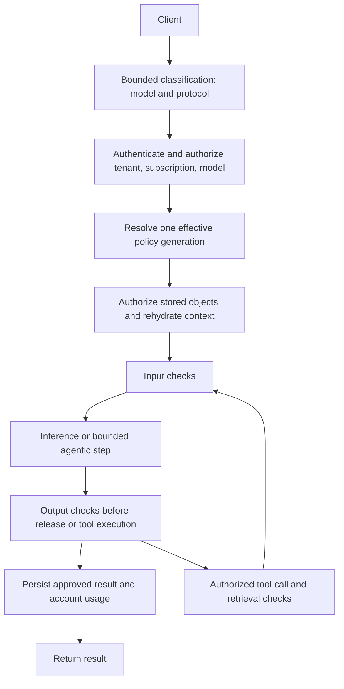

# Responses: enablement, storage and request lifecycle

|         |                                                       |
|---------|-------------------------------------------------------|
| Status  | Proposed                                              |
| Authors | Pierangelo Di Pilato, Christina Xu, Marius Ion Danciu |

This document defines tenant enablement, Responses database architecture, durable user ownership and request lifecycle.
The combined filter chain and authentication handoff live in the guardrails companion because their execution boundaries
must be reviewed together.

Read alongside:

- [Responses and guardrails: high-level design](01-guardrails-responses-high-level-design.md)
- [Guardrails: API, Praxis compilation and reconciliation](02-guardrails-low-level-details.md)
- [Responses: future expansion and capability discovery](03-responses-future-expansion.md)

- [Guardrails: future expansion](04-guardrails-future-expansion.md)

In this document:

- [Responses enablement and lifecycle](#responses-enablement-and-lifecycle)
- [Responses database architecture and enterprise isolation](#responses-database-architecture-and-enterprise-isolation)
- [Request processing and Responses ownership](#request-processing-and-responses-ownership)
- [Stateful operations and persistence transactions](#stateful-operations-and-persistence-transactions)
- [Streaming and usage](#streaming-and-usage)
- [Request-path security and privacy contract](#request-path-security-and-privacy-contract)
- [Responses and Conversations using existing filters](#responses-and-conversations-using-existing-filters)
- [Tenant capability state transitions](#tenant-capability-state-transitions)
- [Reviews](#reviews)

## Responses enablement and lifecycle

The [tenant example](01-guardrails-responses-high-level-design.md#proposal-through-resource-examples) shows the initial
enablement fields and platform storage mode.

Omission means Responses is disabled. Enabling it requires Praxis; reject an IPP combination rather than implicitly
transferring payload-processing ownership. Subscription and Model cannot enable a disabled tenant capability. Model
capability is a further restriction, not another infrastructure switch. Initially, access to Responses follows existing
model/subscription authorization. A separate subscription entitlement can be added if product requirements demand one.

Initially, tenants use a platform-provisioned Responses database binding in the shared infrastructure namespace,
following the existing MaaS operational pattern: per-tenant runtime deployments consume a shared database connection
Secret. `PlatformDefault` selects that binding; it does not reuse the API-key database or its credentials. Enabling
Responses requires the platform binding to exist and pass validation; no database is provisioned implicitly.

`PlatformDefault` is the only initial storage mode and is the default when `storage.mode` is omitted.
This proposal adds a separate Responses database binding using the existing Secret-based convention; it does not
change MaaS API database configuration or require migration of its database or connection Secrets.
Per-tenant overrides and database provisioning are [future storage options](03-responses-future-expansion.md#future-storage-bindings).

The proposed platform convention is a separate `responses-db-config` Secret with key `DB_CONNECTION_URL`, plus
`responses-db-ca` with key `ca.crt`, in the configured infrastructure namespace. These names are new proposed
conventions, not existing MaaS resources. The platform administrator provisions them; tenant/model/subscription editors
cannot replace this platform binding. The compiler projects the connection privately into each enabled tenant's Praxis
runtime and compiles verified TLS. The database can be on the same PostgreSQL instance as MaaS, but must be a separate
logical Responses database with separate credentials. SQLite remains suitable for local examples, not shared production
state.

The controller reports `ResponsesReady` only after storage connectivity, schema migration, ownership enforcement and
route activation are ready. Prepare new resources before switching routes. Disabling Responses stops all its public
operations, including retrieval, but retains data; reject continuations rather than falling through to a backend's
independent response store. Tenant deletion honors
`Retain` by default; externally managed databases are never deleted. Retained data is bound to the old tenant UID and
cannot be inherited by a recreated tenant with the same name. Storage mode/connection changes with existing data require
an explicit migration; ordinary reconciliation must not silently move the store.

Retention applies to responses, conversation items and derived continuation state. A cleanup job and deletion semantics
must implement `maxAge`; it is not an existing Praxis retention guarantee. Expired/deleted objects return not-found.
Concurrent conversation append/delete and continuation operations need version checks or transactions. Define deletion
tombstones so a late in-flight write cannot recreate a deleted response.

The [model example](01-guardrails-responses-high-level-design.md#proposal-through-resource-examples) shows the
capability declaration.

`ChatCompletions` is the default for every backend kind, including `LLMInferenceService` and `ExternalModel`, when
`spec.capabilities`, `capabilities.responses` or its `mode` is omitted. Praxis translates the supported Responses subset
to Chat Completions. `Native` is an explicit opt-in declaring that the selected backend accepts native Responses
requests.

Defaulting selects the adapter; it does not enable Responses on a disabled tenant or establish backend compatibility.
Validate the effective mode against the selected provider and report mismatches. Never silently discard unsupported
parameters, multimodal input or tool types, or automatically switch to `Native` after a translation failure. Both modes
retain the tenant's single public Responses lifecycle, including persistence and continuation; backend IDs must not
bypass it. The [native compilation contract](02-guardrails-low-level-details.md#compilation-target-and-existing-limits)
assumes an explicit `mode: Native` declaration.

`Unsupported` explicitly disables Responses for this model even when the tenant enables it. Embedding-only and
reranker-only models should declare this mode. Reject all Responses inference and continuation attempts using an
unsupported model at gateway admission before Responses orchestration, guardrail callouts or backend inference;
ownership-authorized deletion of existing records remains available under the lifecycle rules. This mode does not
disable the model's embedding/reranking endpoints or bypass their independent authorization/policies. Omission still
defaults to `ChatCompletions`; it is not automatic task detection. Without capability discovery or an explicit
declaration, the gateway cannot infer that an otherwise unknown model is embedding-only or reranker-only. This default
does not preserve a prior Responses path: it introduces the translation path for the new API. Changing the
omitted-capabilities default would revise this proposal's explicit `ChatCompletions` choice; it is not an implied
change to existing embedding/reranking routes.

```yaml
kind: MaaSModelRef
spec:
  capabilities:
    responses:
      mode: Unsupported
```

!!! note "What Responses enablement includes"

    `responses.enabled: true` enables core Responses and Conversations together, sharing database binding, ownership
    enforcement and retention. There is no separate `features` field or Conversations toggle. File search and MCP are
    optional tools, are not required for Responses, and will be discussed separatelly.

Core Responses includes create, retrieve, delete, input-items and continuation. `ResponsesReady` requires both Responses
and Conversations persistence/authorization contracts to be ready; disabling Responses withdraws both API surfaces while
retaining data. Reject requests selecting deferred tools before inference or outbound discovery/calls, and reject
unknown feature fields rather than silently accepting them.

Files, document extraction, vector stores, web search and MCP remain future capabilities requiring separate API and
binding designs, trusted authentication, egress policy, size/time limits and advertised protocol coverage.
The [deferred agentic flows](03-responses-future-expansion.md#deferred-agentic-flows)
preserve future architectural context and existing Praxis building blocks, not initial feature availability.

## Responses database architecture and enterprise isolation

### Decision and workload boundaries

The initial baseline is **a shared Responses database and connection binding for enabled tenants**, separate from the
MaaS API-key database and credentials. Each tenant retains its own Praxis runtime, but runtime separation is not a
database isolation boundary when credentials are shared. Every store operation must enforce the trusted tenant UID and
principal ownership, including reads, updates, deletion, continuation, conversation append and cleanup. Tenant-specific
TTL and deletion must never remove another tenant's records; coordinate shared schema migrations across all runtime
generations. This is a release requirement; the current store must not be assumed to supply tenant isolation merely from
a URL or table name. Shared activation remains blocked until the selected implementation proves that contract.

A shared credential also means compromise of one runtime can expose other tenants' Responses data. This initial mode is
suitable only where that shared trust boundary is acceptable. Customers requiring database-enforced tenant separation
must wait for or prioritize the per-`AITenant` override, with separate databases/roles and potentially separate
instances. Keep that path in the architecture without presenting it as initially implemented. Do not silently use the
API-key connection as a fallback under either mode.

The existing API-key schema stores hashes rather than plaintext keys, but also usernames, groups, descriptions and usage
timestamps. It is security-sensitive identity data and can contain PII; it must not be classified as harmless metadata.
Responses adds arbitrary customer content, potentially including credentials accidentally pasted into prompts, regulated
data, confidential documents, model outputs, conversation history and tool results. Guardrail execution does not certify
that this content is safe to persist. See the existing
[API-key schema](../../../../../maas-api/db/schema/0001_create_api_keys.up.sql).

| Requirement         | MaaS API-key store                                                                               | Responses store                                                                                                                           |
|---------------------|--------------------------------------------------------------------------------------------------|-------------------------------------------------------------------------------------------------------------------------------------------|
| Primary operations  | Key validation, revocation, listing and usage updates                                            | Response writes, history reads, conversation append, continuation and expiry/deletion                                                     |
| Data volume         | Relatively compact identity/key records; authentication traffic still requires capacity planning | Variable and potentially large payloads; tool loops and retained histories amplify writes and storage                                     |
| Availability impact | Failure can prevent authorization for inference across protocols                                 | Failure prevents stateful Responses operations; independent Chat Completions should remain available where other dependencies are healthy |
| Data lifecycle      | Key validity, revocation and identity/audit lifecycle                                            | Explicit content TTL, user deletion, derived-state cleanup and backup expiry                                                              |
| Access model        | Authentication service and tightly controlled identity administrators                            | Tenant/principal ownership checks plus separately authorized content operations                                                           |
| Recovery risk       | Restoring old state can revive revoked credentials unless revocations are reconciled             | Restoring old state can resurrect deleted content or conversation items unless deletions are reconciled                                   |
| Capacity pressures  | Validation latency, indexes and update contention                                                | Payload bytes, write throughput, WAL growth, history reads, cleanup/vacuum and connection fanout                                          |

These stores have no cross-database transaction dependency. Praxis consumes trusted MaaS authorization context; it does
not query API-key tables or receive their database credentials. Responses state and its durable usage outbox remain in
one Responses transaction boundary; downstream metering consumes records idempotently. Do not introduce a distributed
transaction with the key database on the inference path.

### Supported deployment choices

Here, an instance means a PostgreSQL service/cluster with a common administrative and physical recovery boundary, not
merely a Kubernetes Pod. Database separation and workload isolation are different properties.

| Topology                                                        | Proposed support                                            | Boundary and tradeoff                                                                                                         |
|-----------------------------------------------------------------|-------------------------------------------------------------|-------------------------------------------------------------------------------------------------------------------------------|
| API-key and Responses tables in the same database/schema        | Not an initial supported production topology                | Table names alone provide no credential, capacity or recovery isolation; reject known reuse of the MaaS database binding      |
| Separate schemas in the MaaS database                           | Not an initial supported production topology                | Grants can separate access, but migration/search-path mistakes and common database operations create avoidable coupling       |
| Shared Responses database, separate from API keys               | Initial platform-default mode                               | Shared credentials and failure domain; verified tenant/owner enforcement required                                             |
| Separate Responses database per tenant on a shared instance     | Future per-tenant override                                  | Separate roles and grants; shared CPU, memory, I/O, connection ceiling, administrators, maintenance and physical backups      |
| Separate Responses PostgreSQL instance from the API-key service | Recommended for stronger workload and operational isolation | Independent capacity, maintenance and recovery; increases cost and operational responsibility                                 |
| Dedicated Responses instance per tenant/security domain         | Future per-tenant external binding                          | Stronger administrative and failure separation when networking, credentials, backups and runtime placement are also separated |

Do not infer physical isolation from different hostnames or Secret names: aliases, proxies and managed services may map
them to the same instance. Admission can reject a known reused database identity and enforce platform-approved bindings;
the database/platform owner must attest the actual topology. A shared instance is an explicit operational choice, not an
automatic fallback when a dedicated service is unavailable. PostgreSQL schemas require carefully controlled grants and
`search_path`; a schema is not equivalent to a separate database. See
[PostgreSQL schema security](https://www.postgresql.org/docs/current/ddl-schemas.html).

The same API supports small and large deployments. Size alone does not select a security tier: a small tenant handling
sensitive content may require a dedicated service, while a large trusted environment may accept shared infrastructure
with measured capacity limits. No topology by itself establishes compliance with every customer's requirements.

### External database binding and Praxis compilation

The initial compiler resolves the shared infrastructure `responses-db-config` and `responses-db-ca` binding. The future
`storage.externalPostgres.connectionSecretRef` override changes only binding resolution: it identifies another approved
host/database/identity. Both lower to the same Praxis store configuration. Missing bindings fail readiness; there is no
`reuseMaaSDatabase` fallback and no model/subscription storage override.

| Tenant storage input or deployment requirement | Materialization and owner                                                                                                                                                     |
|------------------------------------------------|-------------------------------------------------------------------------------------------------------------------------------------------------------------------------------|
| External connection Secret                     | AI Gateway controller produces a Secret-backed private runtime configuration for Praxis `openai_response_store.database_url`; no credential in the public ConfigMap or status |
| CA binding and verified server identity        | Mount CA and compile `ssl_mode: verify-full` plus `ssl_root_cert` for the selected PostgreSQL endpoint                                                                        |
| Resolved Responses database                    | Initially shared tables require trusted tenant and owner scoping on every operation; future dedicated databases retain ownership checks                                       |
| Responses enablement                           | Compile the existing Responses, Conversations and rehydration filters, with one coherent tenant store shared by applicable plans                                              |
| Schema version and migration authority         | Praxis store initializes tables at startup; future versioned migrations remain Praxis-owned and coordinated before readiness                                                  |
| Content TTL and deletion lifecycle             | Retention worker against the same database and ownership/tombstone model; not an extra inference-time MaaS service                                                            |
| Connection and byte/concurrency budget         | Validated runtime pool settings and admission limits; budget all store instances and replicas, including rollout overlap                                                      |
| External HA, backup and encryption policy      | Provision and verify through the database/platform owner; these are not Praxis filter settings                                                                                |

The inference path still executes compiled Praxis configuration, initially hosted by Praxis ExtProc and eventually by
standalone Praxis. Provisioning, migrations and retention are control-plane or maintenance work; a filter chain cannot
provision HA or prove backup policy. Do not invent Praxis YAML fields for those operations. The compiler must reject a
requested capability that the selected runtime cannot enforce, rather than mark the tenant ready based on successful
YAML rendering.

### Database provisioning, initialization and migration ownership

Follow the existing MaaS API pattern of application-owned schema lifecycle, using Praxis's existing store initialization
for Responses. Keep database provisioning separate from table initialization:

| Responsibility                                                       | Component and contract                                                                                                                                     |
|----------------------------------------------------------------------|------------------------------------------------------------------------------------------------------------------------------------------------------------|
| PostgreSQL service, logical database, role and connection/CA Secrets | Platform/database administrator provisions them before enablement; initial external storage does not create a database server or execute `CREATE DATABASE` |
| Responses and Conversations tables and schema-version metadata       | Praxis `PostgresResponseStore` initializes them while constructing the configured stores, in either execution host                                         |
| Schema changes across Praxis releases                                | Praxis owns the schema definitions and must supply the migration path; neither MaaS API nor the AI Gateway controller authors Responses SQL                |
| Deployment sequencing and readiness                                  | AI Gateway integration supplies the binding, coordinates initialization/upgrade and activates traffic only after successful schema checks                  |

MaaS API's `NewPostgresStoreFromURL` connects to an existing database and runs embedded versioned migrations with
`golang-migrate` before returning a usable store. See
[the existing startup migration implementation](../../../../../maas-api/internal/api_keys/db_driver.go). Praxis already
follows the startup-initialization part of this pattern: `PostgresResponseStore::new` executes generated DDL, validates
table columns and stamps/checks the schema version. The configured Responses and Conversations filters use this store
implementation. A version mismatch currently returns a migration-required error; this is **not** an existing incremental
migration runner. No new MaaS schema-initializer component is needed for first-use table creation.

Initially, allow Praxis startup to initialize its dedicated Responses schema using narrowly scoped DDL permissions. That
credential can create/own Responses tables and therefore is more privileged than a DML-only serving credential; it must
have no access to the API-key database. Coordinate first-start initialization across filters and tenant replicas sharing
the database; idempotent DDL alone does not establish concurrent initialization safety. Initialization failure leaves
Responses unavailable, without falling back to another database.

Before a release changes the stored schema, Praxis must provide versioned migration steps, compatibility checks and a
single-writer coordination mechanism per database/schema. It can extend startup initialization, as MaaS API does, or
provide a migration command executed as a pre-activation job. The AI Gateway integration orchestrates that command but
does not duplicate its SQL. Do not imply that a migration CLI/job exists today, or start independently competing
migrators for each tenant against the shared database.

For deployments requiring DML-only serving credentials, retain a future separated migration job/credential option.
Praxis needs a validation-only startup path after that job, since its current constructor executes DDL and can stamp
schema metadata. This separation is not required by the initial configuration API, but is a prerequisite for deployments
whose security policy disallows runtime DDL. The migration credential must then remain outside serving Pods.

### Security controls and enterprise responsibilities

- **Database identities:** distinct roles for MaaS API keys, the shared Responses runtime binding, migrations and
  maintenance. Future tenant overrides use dedicated runtime roles. The initial runtime credential needs the limited
  Responses-schema DDL/ownership permissions described above; a future separated migrator permits DML-only serving.
  Neither runtime credential may read the key database, create roles, install extensions or act as superuser. Explicitly
  restrict database connection and schema/table privileges; a different database name alone does not enforce access
  denial. Retention workers receive only the privileges required for their cleanup protocol.
- **Application ownership:** the initial shared database requires tenant/principal ownership enforcement on every
  operation. Future database-per-tenant bindings reduce tenant blast radius but do not replace these checks. Row-level
  security can add defense in depth if introduced, including pooled-connection identity reset and transaction scoping.
  It is not currently promised by the Praxis store. Table owners and privileged roles can bypass ordinary RLS, and a
  compromised runtime holding the initial shared credential can expose all tenants in that Responses database.
  See [PostgreSQL row security](https://www.postgresql.org/docs/current/ddl-rowsecurity.html).
- **Network and credential boundaries:** permit database access only from the tenant runtime and approved maintenance
  workloads; use verified TLS, restricted egress and short-lived credentials where supported by the connection/rotation
  implementation. Project only the Responses credential into the tenant Praxis runtime. Secret update must
  drain/reconnect pools or roll the generation before the old credential is revoked. Infrastructure administrators with
  Secret/workload access remain inside the trust boundary; dedicated DBs do not remove that access.
- **Encryption and key custody:** require encryption of primary storage, replicas, snapshots and backups through the
  selected platform. Customers may require distinct customer-managed keys and separate backup administrators.
  Application envelope encryption could further restrict database-operator plaintext access, but requires a separate
  design for key service access, rotation, queries and recovery; it is not provided by a PostgreSQL connection setting.
  Praxis and approved model/guardrail services still process plaintext during inference.
- **Residency and support access:** approve the database region, replicas, backup/archive destinations and operational
  access locations together. Audit privileged content access and database-binding changes without recording content or
  credentials. Query logging, slow-query diagnostics, traces, crash dumps and support bundles must follow the same
  content policy; parameterized SQL alone does not guarantee that monitoring never captures values.
- **Persistence policy:** `store: false` prevents durable Responses content storage under the lifecycle contract; it
  does not promise that model providers, detectors or tools retain nothing. A platform that must prohibit content
  persistence regardless of caller choice needs an enforceable tenant storage policy and protocol behavior for
  continuation and Conversations before it can advertise that mode. TTL is not a substitute for such a policy.

For each production deployment, record the responsible database operator, approved isolation topology, content
classification, maximum retention, permitted locations, key ownership, privileged access procedure, availability target,
RPO/RTO and tested recovery procedure. These are deployment acceptance inputs, not a claim that a CR reconciler can
verify a customer's complete security policy.

### Retention, recovery, capacity and failure behavior

`retention.maxAge` limits live content availability; it is not a guarantee that bytes vanish from backups at that
instant. Define the expiry clock for each object and whether conversation activity affects it, bound cleanup delay, and
cover conversation items, derived state and outbox payloads. Keep usage events free of prompt/response bodies and define
their separate retention. Do not retain blocked raw output for diagnostics by default. Erasure applies to derived
content and any separately enabled file/vector storage under their own contracts.

Backups and WAL archives need explicit retention, encryption and access policies. Restore into a quarantined target,
reapply deletion/expiry records from a source that survives the rollback, validate tenant identity and authorization,
then activate it. Tombstones stored only inside the restored backup cannot prevent resurrection of later deletions.
Document the delay until erased content ages out of backups; immediate erasure requirements need an independently
validated design. Any legal-hold workflow must be explicit, authorized and reflected in the advertised deletion
behavior.

Separate logical databases on one instance do not provide independent physical point-in-time recovery. PostgreSQL's
physical backup/WAL recovery operates on the cluster; tenant recovery may require restoring an isolated cluster and
extracting/reconciling one logical database. Do not rewind the live shared instance to recover Responses and thereby
roll back key revocations or other tenants. See
[PostgreSQL continuous archiving and recovery](https://www.postgresql.org/docs/current/continuous-archiving.html).

Size the Responses service using retained bytes and write amplification, including indexes, history copies, tools, WAL,
replicas and backups. Bound request bytes, conversation growth, tool iterations, concurrent operations and retained
bytes per tenant; define admission and cleanup behavior at each limit. Sum connection pools across filters, replicas,
rollout surge and maintenance jobs, leaving database headroom. A separate database on the same instance does not provide
hard CPU/I/O isolation, so shared hosting needs reserved capacity and admission limits to protect authentication
latency. No unlimited-scale guarantee follows from PostgreSQL or tenant separation.

Database outages fail stateful Responses operations closed with bounded timeouts and actionable readiness, never by
switching to the key database, SQLite, a backend's private store or silently discarding persistence. Draining, uncertain
commit outcomes, idempotent retries and durable usage follow the transaction lifecycle below. Recovery requires a
reachable writable primary; a TCP connection or a lagging replica does not establish readiness for continuation.

Moving an existing tenant to a dedicated service is a data migration, not ordinary credential rotation: provision and
migrate the target, fence admissions and drain writers (or use a separately designed online migration protocol), copy
and validate data/tombstones/ownership, switch one generation, and retain the old target under its deletion policy.
Never allow old and new generations to diverge as independent writable stores. Define rollback before cutover; once new
writes exist, switching back requires reconciliation, not simply restoring the old Secret.

## Request processing and Responses ownership



Only bounded parsing needed to identify the request runs before authentication. Database access, NeMo, file resolution,
MCP discovery and tool calls run after the outer authorization boundary. The supplied agentic example explicitly warns
that StreamBuffer callouts can precede listener header filters: putting an auth filter first in a YAML list does not
establish this boundary.

Responses handlers and agentic execution compile into Praxis filters for the selected host, as specified
in [Materializing MaaS configuration in Praxis](02-guardrails-low-level-details.md#materializing-maas-configuration-in-praxis).
In the initial ExtProc target, Envoy owns ordinary model forwarding. Local stored-object operations and iterative
subrequests need explicit adapter support so a terminal local result is delivered without a duplicate Envoy upstream
request. Unsupported compositions remain unavailable; do not introduce a parallel tenant HTTP proxy as an implicit
fallback. Explicit standalone Praxis deployment is a supported architectural direction, subject to
the [deployment target and migration contract](02-guardrails-low-level-details.md#deployment-targets-and-standalone-evolution).
The AI Gateway controller owns the generated target-specific Praxis configuration and network integration; MaaS owns the
authentication and selected-subscription contract consumed by it.

Carry trusted tenant, principal, subscription and model UIDs plus policy generation through internal metadata. Strip
spoofable incoming routing/policy headers; do not expose credentials or internal identity metadata to model providers. A
trusted principal is the authenticated issuer/subject pair (or equivalent stable identity), not a client `user` field or
an API-key string.

The [AuthPolicy-to-Praxis identity handoff](02-guardrails-low-level-details.md#relationship-to-maasauthpolicy-and-the-generated-gateway-authpolicy)
defines how authentication supplies this ownership context to the generated filter configuration.

Praxis must extend its record schema and store interfaces to persist and enforce the ownership tuple below on every
operation, including local responses that bypass later filters. The store obtains ownership from trusted request
context; it must not load content by tenant and object ID and rely on a later filter to reject another user's access.

Store object ownership as `(tenant UID, principal issuer, principal subject)` together with model UID, policy revision
and timestamps. Reads, deletes, input-item pagination, conversation operations and `previous_response_id` all verify
this stable owner. Key rotation and changing subscriptions preserve access for the same authenticated principal within
the tenant. Default to no cross-user or cross-tenant sharing. Missing/unauthorized objects have indistinguishable
not-found responses. Revalidate model access under MaaSAuthPolicy on continuation and reads of stored model content.
Ownership-authorized deletion is the exception defined in
[Stateful operations and persistence transactions](#stateful-operations-and-persistence-transactions).

**Why subscription is excluded from ownership.** A conversation can outlive the subscription used to create it.
Including subscription UID in the owner key would make that content inaccessible after a subscription switch, deletion
or recreation, even though the same principal still owns it and retains model access. It would also couple future
automatic subscription selection for limits/QoS to storage identity, requiring content migration or ownership aliases
for an ordinary request-policy change. Conversely, two users sharing a subscription must not gain access to each other's
content. Tenant plus stable principal is the durable boundary; subscription remains a separately evaluated policy and
attribution dimension. Preserving ownership does not preserve old privileges: every operation still applies current
model authorization and applicable policy. Subscription deletion must not cascade-delete owned conversation data or
prevent ownership-authorized erasure.

Subscription governs the current request's limits, QoS and subscription-scoped guardrails; it is not part of durable
ownership and does not grant model access. Select and validate the current subscription separately for operations that
need these policies. Retain the creation subscription and each subsequent operation's selected subscription as audit and
usage attribution, never as an owner lookup predicate. A continuation under another eligible subscription keeps the same
conversation owner and uses the newly selected subscription's limits, QoS and effective guardrails. Recheck stored
context when the effective policy changes, even if both subscriptions' resources are otherwise unchanged. This permits
future automatic subscription selection without implementing switching rules here. Freeze the selected subscription for
an admitted request/agentic loop; switching between requests must not reset usage accounting or bypass quota policy.

Bodyless GET/DELETE routes cannot use body-based model selection. Authenticate first, look up only an ownership-scoped
record, then apply the operation-specific authorization from the table below: reads revalidate model access and apply
current request policy, while deletes require ownership independently of subscription availability. Apply the same
distinction to local conversation operations. The existing Praxis `(tenant_id, id)` store isolation is necessary but
insufficient for this ownership contract; this is a required implementation change, not a current guarantee.

Input checks inspect the canonical context actually sent to inference, including rehydrated history and resolved text.
Preserve roles and tool-call associations. Unsupported image/audio/file representations must fail when a required policy
cannot evaluate them; do not silently reduce a multimodal request to its text part. Initially support text and reject
unsupported protected modalities. Output checks must run before persistence, client release, or execution of a proposed
tool call. Retrieved/tool-produced content is untrusted and must be checked before reinference; actual NeMo
retrieval/dialog rails require explicit adapters and context contracts, not just toggling `options.rails.retrieval` on
arbitrary chat messages.

Agentic support must evaluate every model iteration and tool boundary. Bound total iterations, elapsed time, body/state
size, concurrency and callout fanout. The limit from the example is an example, not a tenant default. Reauthorize any
change of model. Freeze the policy generation per request/loop for determinism; emergency revocation requires
cancellation. Continuations resolve the current policy and recheck their context. Stored results remain attributable to
their original policy; for retrieval under a newer output policy, recheck before release or reject until such rechecking
is supported. Do not describe historical content as checked against a policy it never passed.

## Stateful operations and persistence transactions

The public contract distinguishes authentication, object ownership, model access and content evaluation. Sharing an
object ID never establishes any of these grants. The table describes proposed MaaS behavior for core operations; it does
not assert that the current Praxis handlers enforce it.

| Operation                            | Authorization and execution                                                                                                                      |
|--------------------------------------|--------------------------------------------------------------------------------------------------------------------------------------------------|
| `POST /v1/responses`                 | Authenticate, authorize model access via MaaSAuthPolicy, select subscription for limits/QoS/guardrails, then process content                     |
| POST with `previous_response_id`     | Additionally verify the prior object's ownership and retained model authorization before loading its content                                     |
| `GET /v1/responses/{id}`             | Ownership-scoped lookup, current MaaSAuthPolicy model authorization, then applicable current-request output policy check                         |
| `GET /v1/responses/{id}/input_items` | Same ownership/model checks; re-evaluate returned input context under current Input policy when its stored revision differs                      |
| `DELETE /v1/responses/{id}`          | Authenticate and verify ownership; no NeMo call is needed to erase an owned object, even if model access or subscription eligibility was revoked |
| Create an empty conversation         | Authenticate, verify tenant Responses permission and establish tenant/principal owner; apply operation limits/policy separately                  |
| Read/append conversation items       | Verify owner and referenced model access; apply current subscription policy where applicable and check newly appended input                      |
| Delete a conversation                | Ownership-authorized deletion without requiring a healthy guardrail service                                                                      |
| Files/vector-store/tool operations   | Unavailable unless separately enabled with their own ownership and authorization contract                                                        |

The deletion exception above prevents a policy or model revocation from trapping user content. It does not let an
expired/revoked credential authenticate. An authorized administrative data-erasure path is an operational responsibility
for owners who can no longer authenticate. For mixed-model conversations, authorize every model whose content will be
exposed or sent to a new model; checking only the latest model is insufficient. The first implementation may restrict a
conversation to one model UID and reject a model switch until multi-model authorization is implemented.

A `previous_response_id` continuation creates a new response; it does not mutate the previous response. Requests
referring to expired, deleted or inaccessible ancestors fail before inference. Pagination cursors bind owner, object and
ordering, so a cursor from another object cannot widen access. Pagination must not return raw stored input that a new
policy would reject simply because the endpoint lacks a `model` body.

A finite successful operation has these logical stages:

1. Resolve ownership and reserve quota; generate operation/response identity.
2. Load authorized history and evaluate input; do not persist rejected raw input.
3. Perform inference and evaluate output before committing client headers or body.
4. Atomically persist the approved response and any conversation append, guarded by the conversation version and
   deletion tombstones. Persist provenance and expiry.
5. Record usage through a durable, idempotent accounting path and return the response.

Steps 4 and 5 need a transactionally written accounting intent/outbox or an equivalent recovery mechanism; a best-effort
log is not a durable charge record. A retry must not charge the same completed operation twice. A database failure after
model execution still consumes upstream tokens: fail the storage-dependent operation, record/recover usage, and do not
claim the result is retrievable. Do not automatically replay model inference to hide that failure. An explicit client
retry is a new billable attempt unless an idempotency contract proves otherwise.

For `store: false`, keep state only for the current request and return no retrievable record. Initially reject
`store: false` combined with conversation mutation rather than ambiguously retaining its input/output as conversation
history. An authorized previous response can still supply read-only context for an unstored new response. Store checks,
quota accounting and minimal operational failure records must not retain raw prompt/output content through a side
channel.

Conversation updates use optimistic concurrency or serialization per conversation. A conflict discovered after inference
must not overwrite another turn; return a conflict and account for consumed work. Cleanup atomically expires items and
blocks new continuations from them. Parent conversation retention does not extend the TTL of expired content. Backup
retention and restore procedures must honor erasure requirements; deleting live rows alone does not establish deletion
from backups.

## Streaming and usage

The initial enforcement contract uses non-streaming responses when Output checks apply. Reject `stream: true` and
WebSocket requests before inference in that case; never silently skip Output checks or convert the protocol. Input-only
guardrails can permit streaming on a pipeline proven to support it. A future buffered-stream mode must withhold every
content/tool event until its verdict and define latency, SSE error framing and persistence behavior explicitly.

The inspected standalone Praxis AI guardrail filter skips SSE and its finite-response error path can preserve HTTP 200
or truncate the replacement body. ExtProc adds its own body buffering and length-mutation behavior; verify the combined
adapter/filter path rather than assuming it has the standalone transport semantics. Before releasing Output guardrails,
verify and extend the selected target's pre-commit response gate (ExtProc/Praxis initially, standalone Praxis later)
so it can set status and correct framing. Reordering filters alone does not establish that gate. Check reverse
response-filter traversal so blocked output cannot be saved as a completed response or appended to conversation history.
Persist only approved content and minimal failure metadata;
`store: false`
must not cause hidden response/history persistence.

The existing [quota documentation](../../../configuration-and-management/quota-and-access-configuration.md)
excludes Responses from token rate limiting. Responses enablement must therefore include a usage adapter and enforcement
path, or explicitly remain a limited preview rather than promising existing subscription quotas. Meter each inference
iteration, including work whose output is later blocked; reject-before-inference uses no generation tokens. Guardrail
detector calls get separate operational usage. Avoid double counting a final aggregate and its subcalls. Budget
enforcement must cover iterative amplification and missing usage, with bounded reservations and reconciliation; do not
interpret missing usage as zero. Request admission quotas also cover storage operations and failed checks.

## Request-path security and privacy contract

The critical authority boundaries are between platform administrators, tenant administrators, model publishers and
inference callers. Kubernetes write permission to a resource permits changes to that resource's own requirements; it
does not imply a right to remove another resource's requirements. Protect policy provider references as sensitive
data-destination configuration, even though they contain only Secret refs. Anyone who can replace a provider endpoint
can redirect future prompt content.

Database isolation, content classification, credentials, backup/erasure and operational acceptance are defined in
[Responses database architecture and enterprise isolation](#responses-database-architecture-and-enterprise-isolation).

The request and object rules are defined
in [Request processing and Responses ownership](#request-processing-and-responses-ownership)
and [Stateful operations and persistence transactions](#stateful-operations-and-persistence-transactions). Threat
coverage must include spoofed internal headers, direct access to the Praxis Service, cross-tenant resource references,
same-name resource recreation, bodyless endpoints, revoked subscriptions and alternate native-backend routes. Private
in-cluster connectivity is not itself an authentication guarantee.

Default telemetry contains request/operation IDs, opaque plan digest, latency, phase, verdict category and aggregate
usage. Avoid raw prompts, output, NeMo
`context`/`state`, credentials, detector logs and arbitrary rail error details. Privileged diagnostics can expose
provenance only to administrators who can view its source objects. Metrics use bounded labels such as
phase/provider/verdict, not principal IDs, response IDs or unconstrained config names. Audit publication of policy and
data-destination changes separately from inference content.

NeMo sees the content sent to its checks, and its configs can call additional models or action servers. Approval of a
provider/policy must therefore include its downstream data destinations and retention behavior. Encrypt stored content
through the platform's storage controls and use verified TLS in transit. Credential rotation, backup access, erasure,
restore and incident response require explicit operational ownership.

Policy changes follow the
shared [publication lifecycle](02-guardrails-low-level-details.md#generation-activation-and-runtime-rollout).
Existing [authentication caching](../../../configuration-and-management/authorino-caching.md) still applies: selection
caches cannot prolong expired authorization. Required changes fence affected admissions; already-admitted operations
retain pinned policy unless cancelled explicitly.

## Responses and Conversations using existing filters

The [consolidated example](02-guardrails-low-level-details.md#worked-compilation-of-the-introductory-resources) shows
the tenant's Conversations, PostgreSQL store, rehydration and default Chat Completions translation in the same chain as
the resolved guardrails. Explicit `Native` mode replaces translation/path rewriting with `openai_responses_proxy`;
`Unsupported` rejects model execution before this path. Bodyless operations still use the local ownership/authorization
contract.

## Tenant capability state transitions

| Transition                             | Required behavior                                                                                                    |
|----------------------------------------|----------------------------------------------------------------------------------------------------------------------|
| Disabled → Enabling                    | Validate references and backend capabilities; provision runtime/storage; keep managed Responses routes unavailable   |
| Enabling → Ready                       | Complete schema/identity checks, stage config, receive runtime readiness and activate the authenticated route        |
| Ready → storage unavailable            | Fail state-dependent operations; retain Chat availability where its dependencies remain healthy                      |
| Ready → guardrail unavailable          | Fail affected protected operations; unrelated tenants/policies remain usable                                         |
| Ready → Disabling                      | Stop new admissions; allow bounded in-flight work to finish under its pinned plan, then withdraw routes              |
| Disabling → Disabled                   | Retain configured storage and data; stop Responses handlers without forwarding to backend-owned endpoints            |
| Tenant deletion                        | Withdraw admission, drain/cancel work, detach retained storage safely, and remove controller-owned runtime resources |
| Re-enable same tenant UID              | Validate existing schema/data and resume with current authorization and policy; do not skip migration checks         |
| Recreate same tenant name with new UID | New logical tenant; do not attach retained objects as the new tenant's data                                          |

For retained managed storage, finalization must remove deletion ownership that would otherwise garbage-collect the
database/PVC, and record enough non-secret identity for an administrator to recover it. Kubernetes cross-namespace owner
references are not a valid cleanup mechanism: track managed resources explicitly using tenant UID and controller-owned
inventory. A shared runtime namespace also needs uniquely named credentials and workloads derived by the existing
platform naming mechanism.

Future schema upgrades use a single coordinated Praxis-owned migration path per database/schema, with compatible
versions declared by the runtime;
see [initialization and migration ownership](#database-provisioning-initialization-and-migration-ownership). Rolling
upgrade requires an expand/contract migration that keeps the old and new runtime safe concurrently. Reject an
unsupported schema instead of starting with partially usable handlers. Restoring backups and changing storage locations
require a maintenance procedure and explicit validation; a Secret change can rotate credentials, but must not silently
select a different database containing unrelated state.

## Reviews

See the shared [review record](01-guardrails-responses-high-level-design.md#reviews) in the high-level design.
