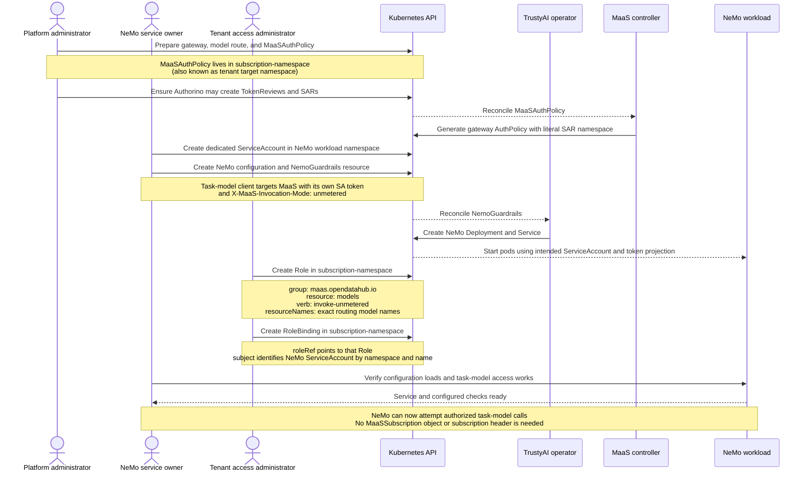
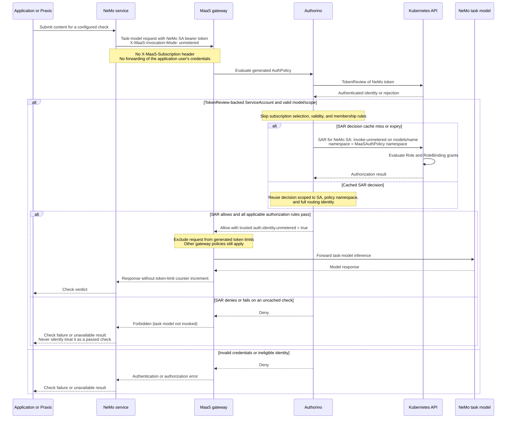

# Guardrails: future expansion

|         |                                                       |
|---------|-------------------------------------------------------|
| Status  | Deferred proposal; outside the initial API            |
| Authors | Pierangelo Di Pilato, Christina Xu, Marius Ion Danciu |

The initial [guardrails API](02-guardrails-low-level-details.md#attachment-selection-and-composition) uses an additive
list of `ref + checks` entries. Every selected check enforces. This document preserves the richer required/default
composition proposal and deferred judge-model authentication options for separate review; neither is a prerequisite
for initial guardrails support.

## Motivation and compatibility

Optional defaults could let tenant administrators suggest checks that model or subscription administrators may replace,
while preserving mandatory protections. This adds editing, precedence and rollout complexity, so it is deferred.

The examples below sketch a future `guardrails.required` and `guardrails.defaults` structure. Introducing that structure
would change the initial list-shaped field: define a versioned API conversion or a separate compatible extension before
shipping it. Existing attachments must retain mandatory, additive behavior after conversion; they must never become
overridable defaults implicitly. No attachment alias is needed in either shape.

Within every attachment, `ref.name` remains required and namespace resolution follows the
[current scoped reference rules](02-guardrails-low-level-details.md#scoped-policy-references), including forbidden
`ref.namespace` on AITenant, MaaSSubscription and MaasTenantConfig, and the two permitted namespace choices on MaaSModelRef. An
omitted or empty attachment `checks`
selects all checks in that AIGuardrail, including future additions. A nonempty list selects named checks. This is
distinct from an empty **list of attachments** in a defaults operation, which can clear optional defaults under
`Replace`. All current namespace validation, provider permission, fail-closed behavior, check identity and execution
ordering apply.

## Exact inheritance and merge semantics

Separate **required checks** from **overridable defaults**. “Default” means a real enforcing check unless an authorized
editor explicitly replaces/disables it; it does not mean audit-only. Required checks can be changed by their resource
owner, but another scope cannot remove or weaken them.

For an authenticated `(tenant UID, subscription UID, model UID)` tuple:

1. Collect required bindings from AITenant, MaasTenantConfig, Model, selected Subscription and its matching
   `modelRefs[]` entry.
2. Start with AITenant defaults; apply MaasTenantConfig defaults, Model defaults, Subscription defaults, then the
   matching subscription model-entry defaults. The consuming application's most specific scope wins for optional
   defaults. Model safety requirements belong in `required`.
3. Combine required and resolved default bindings and expand their policies into a set of selected checks. Deduplicate
   by namespace, AIGuardrail name and check name, preserving all contributing attachment provenance. Run selected checks
   in the deterministic catalog order for each applicable phase; all must pass. A block stops the operation, and an
   error fails closed. There is no “later pass overrides earlier block.”

| Defaults field                                    | Effect on inherited defaults                          |
|---------------------------------------------------|-------------------------------------------------------|
| Absent, or `mode: Inherit`                        | Preserve inherited list; local checks must be absent  |
| `mode: Merge` (default when `checks` is supplied) | Append local checks; do not replace inherited entries |
| `mode: Replace`                                   | Replace the whole optional list with the local list   |
| `mode: Disable`                                   | Empty the optional list; local checks must be absent  |
| `checks: []` with `Merge`                         | No change                                             |
| `checks: []` with `Replace`                       | Explicitly empty the optional list                    |

At Tenant scope defaults seed the list. Explicit `null` is invalid. An attachment is identified by its source resource
UID, attachment path, required/default category and referenced namespace/name. No attachment-level `name` is needed.
Deduplicate execution by `(namespace, AIGuardrail name, check name)`, preserving every origin. Defaults replacement
changes only the optional attachment list; it cannot remove a check selected by any required attachment. Execution order
remains the deterministic catalog order, independently of scope precedence.

Example: Tenant requires `safety`, defaults to `topic`; Model requires `medical`, merges `pii`; Subscription requires
`finance` and replaces defaults with `support`. The selected policy set is `{safety, medical, finance, support}`. With
Subscription
`Merge`, it is `{safety, medical, finance, topic, pii, support}`. With Subscription
`Disable`, it is `{safety, medical, finance}`. No override removes `medical`. A matching subscription model entry with
required
`audit` and defaults `Replace: [specialist]` selects `{safety, medical, finance, audit, specialist}`. Its `Disable`
selects
`{safety, medical, finance, audit}`. Other model entries do not participate. Validate uniqueness of subscription model
namespace/name keys so a request cannot match ambiguous entries.

The future API must retain enforcing, fail-closed checks. It does not expose fail-open, audit-only or redaction as if
they were equivalent to enforcement. A future exception should be an explicit, scoped, expiring waiver authorized by the
owner of the required policy. Do not add a global `guardrails.enabled: false`
that removes inherited requirements. Likewise, do not try to rank arbitrary NeMo configs by “strictness”: different
configs are not generally comparable.

## Five-scope policy resolution: five scopes, two NeMo servers and subscription-specific overrides

Input fragments use the shared attachment shape defined earlier. Every policy ref names its namespace explicitly and
must pass same-tenant membership validation; each NeMo binding satisfies allowedConsumers and tenant approval. The
fragments below show tenant, model and subscription resources, with MaasTenantConfig adding the tenant-admin baseline
and the fifth scope under the matching
`MaaSSubscription.spec.modelRefs[]` entry. They omit unrelated and required resource fields and are not apply-ready
manifests.

```yaml
kind: AITenant
spec:
  guardrails:
    required: [ { ref: { name: safety-v1 }, checks: [ ] } ]
    defaults:
      checks: [ { ref: { name: topic-v1 }, checks: [ ] } ]
---
kind: MaasTenantConfig
metadata:
  name: default-tenant
  namespace: <tenant-namespace>
spec:
  guardrails:
    required: [ { ref: { name: privacy-v1 }, checks: [ pii ] } ]
---
kind: MaaSModelRef
metadata:
  name: granite-7b
  namespace: <model-namespace>
spec:
  guardrails:
    required: [ { ref: { name: privacy-v1, namespace: <tenant-namespace> }, checks: [ ] } ]
    defaults:
      mode: Merge
      checks: [ { ref: { name: tone-v1, namespace: <tenant-namespace> }, checks: [ ] } ]
---
kind: MaaSSubscription
spec:
  guardrails:
    required: [ { ref: { name: audit-v1 }, checks: [ ] } ]
    defaults:
      mode: Replace
      checks: [ { ref: { name: support-v1 }, checks: [ ] } ]
  modelRefs:
    - name: granite-7b
      namespace: <model-namespace>
      guardrails:
        defaults:
          mode: Replace
          checks: [ { ref: { name: specialist-v1 }, checks: [ ] } ]
```

Resolved definitions: `safety-v1` has Input check `safety` on server A; `privacy-v1`
has Input checks `pii`, then `regex` on server A; `audit-v1` has Input check `audit`
on server B; `specialist-v1` has Input check `specialist` on server B. Lexical AIGuardrail order makes this request
execute
`audit, pii, regex, safety, specialist`, preserving the two checks within `privacy-v1`. MaasTenantConfig also requires
`pii`, which executes once. Tenant `topic`, model `tone`
and subscription `support` defaults are not selected; their tenant-local checks may still be configured for other
requests. Another subscription can have a different plan while sharing the same logical model.

The order is determined from the tenant-local catalog, independently of attachment precedence. For each check, emit an
existing `ai_guardrails` entry with the same verified binding-selection `conditions` used above, preserving order.
However, the current NeMo provider cannot express these distinct config IDs on one server. This specific fixture
therefore has no complete supported NeMo lowering yet:
report the unsupported selector requirement until the minimal provider addition above is implemented; do not drop checks
or assume separate endpoints select configurations. The resolution example specifies MaaS semantics independently of
adapter coverage.

## Lifecycle and compatibility

A future rollout must preserve the mandatory behavior of existing attachments and retain all-checks/subset selection
through conversion. Status should explain replaced defaults and their originating scope. The
[initial publication lifecycle](02-guardrails-low-level-details.md#generation-activation-and-runtime-rollout) continues
to govern policy changes; introducing overrides does not weaken ownership or runtime generation checks.

## Judge-model authentication after 3.6

The [3.6 decision and API-key flow](02-guardrails-low-level-details.md#judge-model-authentication-for-36) reuse existing
MaaS capabilities. A new ServiceAccount authorization path was deferred because of the release timeframe, additional customer RBAC resources,
and the testing burden of changes to AuthPolicy and token-limit policies. This was a scope decision, not a conclusion
that a client-supplied header alone can authorize unmetered access.

Revisit these concerns after 3.6 with deployment experience:

- **Credential automation:** manual user-owned API-key issuance and NeMo configuration complicate GitOps, renewal and
  ownership. Define supported Secret references and credential provisioning before describing them as automated.
- **ServiceAccount access:** a tenant administrator with delegated grant/bind authority could grant NeMo's own
  ServiceAccount access to specific models through Role/RoleBinding. TokenReview and SAR would validate the request
  through the gateway. No globally shared guardrail ServiceAccount is assumed. Establish that delegation during platform
  setup rather than requiring cluster-admin participation for each service.
- **Authorization versus accounting:** decide independently whether judge calls need ordinary limits, different limits,
  or an explicit exemption. Keeping usage metrics and choosing how to attribute chargeback remain valid options. The
  PoC below couples SAR authorization to a token-limit exemption as an experiment, not an agreed product requirement.
- **Header and policy security:** a mode header only selects the proposed path. Authenticated ServiceAccount identity
  and a model-scoped SAR grant must authorize it. Validate ANDed rules, denied requests, forged headers, trusted routing,
  cache revocation and effective policy composition before adoption. A small code diff does not remove that burden.
- **Self-check and broader service calls:** reuse of an inference model as its own judge needs explicit recursion and
  inherited-policy handling. Batch access may also motivate a separate service-call path, but neither expands 3.6 scope
  or commits to this particular unmetered mechanism.

Gateway/Authorino SAR without the full MaaS stack was also raised as an alternative. Its deployment and permission
contract remains to be established. Adding a kube RBAC proxy directly to LLMInferenceService was considered additional
integration complexity, not a prerequisite for the selected gateway flow.

The following PoC design and diagrams are retained for that review. The experimental implementation is not included
in this proposal. This section describes the experiment, not shipped behavior or the selected 3.6 deployment contract.

## PoC: unmetered model access

The experimental PoC changes the generated gateway policy to include unmetered access for Kubernetes ServiceAccounts, with guardrail services as one
use case. The authorization scope is the namespace of the `MaaSAuthPolicy`, referred to here as
`<subscription-namespace>` (also known as tenant target namespace). This is a namespace scope only: no
`MaaSSubscription` object or `X-MaaS-Subscription` header is required. There is no feature flag or new API endpoint.

Callers send their own Kubernetes ServiceAccount token and `X-MaaS-Invocation-Mode: unmetered`. For this path,
`subscription-info`, `subscription-valid`, and ordinary membership authorization are skipped. The remaining
applicable authorization rules are ANDed: TokenReview ServiceAccount identity, nonempty model/scope, and SAR must
all pass. Denied unmetered requests do not fall back to ordinary membership access.

The SAR checks `invoke-unmetered` on the synthetic `models` resource in the `MaaSAuthPolicy` namespace.
The namespace is emitted as a literal policy value, never taken from request headers. The model name comes from the
existing routing identity: the second path segment for `/<model-namespace>/<model-name>/...`, or the full
`X-Gateway-Model-Name` identifier supplied by the gateway for body routing. Use that exact name in `resourceNames`.
Body-routed identifiers must be set or overwritten by the trusted gateway, not accepted unchanged from clients.

This minimal PoC does not resolve aliases or check model-name uniqueness. Path-routed models with the same name in
different model namespaces share the same permission within the scope; use unique model names on that gateway if
those models need separate grants. Body-routed aliases are separate permission names, even if they route to the same
model. Other gateway and backend checks continue to apply.

Administrators provision standard Kubernetes Roles and RoleBindings. Replace the placeholders below:

```yaml
apiVersion: rbac.authorization.k8s.io/v1
kind: Role
metadata:
  name: unmetered-access
  namespace: <subscription-namespace> # Also known as tenant target namespace.
rules:
  - apiGroups: [maas.opendatahub.io]
    resources: [models]
    resourceNames: ["<tenant-visible-model-name>"]
    verbs: [invoke-unmetered]
---
apiVersion: rbac.authorization.k8s.io/v1
kind: RoleBinding
metadata:
  name: unmetered-access
  namespace: <subscription-namespace> # Namespace of the MaaSAuthPolicy.
roleRef:
  apiGroup: rbac.authorization.k8s.io
  kind: Role
  name: unmetered-access
subjects:
  - kind: ServiceAccount
    namespace: <service-account-namespace>
    name: <service-account-name>
```

Additional bindings can authorize multiple ServiceAccounts. Authorino itself needs permission to create
`subjectaccessreviews.authorization.k8s.io`; the calling ServiceAccount only needs the `invoke-unmetered` grant.
The SAR checks the authenticated ServiceAccount username without adding group grants.

A path-routed request looks like this; prepare `request.json` for the deployed model's inference API and use a token
with the controller's configured cluster audience:

```bash
curl --fail-with-body "${GATEWAY_URL}/${MODEL_NAMESPACE}/${MODEL_NAME}/v1/chat/completions" \
  -H "Authorization: Bearer ${SERVICE_ACCOUNT_TOKEN}" \
  -H 'Content-Type: application/json' \
  -H 'X-MaaS-Invocation-Mode: unmetered' \
  --data-binary @request.json
```

A successful SAR produces `auth.identity.unmetered: true` through the existing trusted identity filter. Generated
token-limit predicates exclude that request from enforcement and accounting. Client headers cannot supply this
boolean. Ordinary requests retain subscription selection, membership checks, and token accounting.

SAR decisions use `--authz-cache-ttl`, capped by `--metadata-cache-ttl` (both default to 60 seconds). The cache key
includes the authenticated ServiceAccount username, literal policy namespace, and full routing identity. RoleBinding
changes may take effect only after cached decisions expire. Setting either TTL to zero disables SAR caching.

### NeMo example: personas and end-to-end flow

The following example connects NeMo's task-model calls to the unmetered access path. The **NeMo service owner**
deploys and configures NeMo; the **access administrator** grants access to specific model names. The access
administrator can be a tenant administrator with sufficient RBAC grant/bind permissions, or the platform
administrator. These responsibilities may belong to the same person, but deploying NeMo alone does not grant
unmetered model access.

The setup uses the [Role and RoleBinding above](#poc-unmetered-model-access). NeMo deployment follows the
[TrustyAI integration contract](02-guardrails-low-level-details.md#trustyai-integration-and-deployment-topology), and task-model configuration follows
[task-specific model ownership](02-guardrails-low-level-details.md#task-specific-model-ownership). The diagram does not introduce new
`NemoGuardrails` fields: the supported deployment must run NeMo with the intended ServiceAccount, and its model
client must read refreshed tokens and send the invocation-mode header. That client/deployment wiring is an
integration prerequisite; the controller PoC implements the gateway authorization and token-limit exemption.



The runtime flow starts with a configured check submitted by an application or by Praxis on its behalf. Only NeMo's
downstream task-model call is unmetered here; the application's ordinary inference request retains its own
authorization and accounting. Checks that do not call an LLM do not enter this model-access flow.



The separate PoC experiment included unit tests for policy-namespace propagation, routing names, exclusive authorization
branches, absent subscription metadata, cache isolation, and the token-limit predicate. These tests are not included
in this proposal and do not establish cluster validation. Before adoption, verify effective policy
composition, RBAC denial/revocation after cache expiry, and that streaming and non-streaming unmetered calls leave
Limitador counters unchanged. Also verify the trusted body-routing header contract on the installed gateway version.
